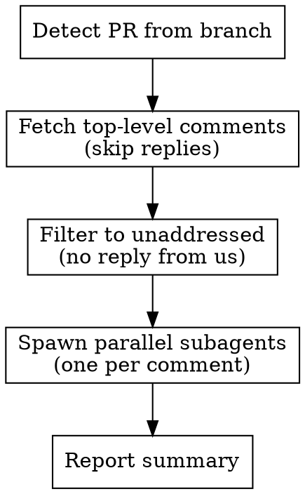

# Respond to PR Review

## Overview

Process all unaddressed PR review comments in parallel. Each comment gets a dedicated subagent that either applies the fix or replies with technical reasoning for disagreement.

**Core principle:** Every comment deserves a thoughtful technical evaluation - not performative agreement or blind implementation.

## Process



### Step 1: Detect PR and Repo

```bash
PR_NUMBER=$(gh pr view --json number --jq '.number')
REPO=$(gh repo view --json nameWithOwner --jq '.nameWithOwner')
```

### Step 2: Fetch Top-Level Review Comments

```bash
gh api "repos/${REPO}/pulls/${PR_NUMBER}/comments" \
  --paginate \
  --jq '[.[] | select(.in_reply_to_id == null) | {id, path, line: (.line // .original_line), body, diff_hunk}]'
```

### Step 3: Filter to Unaddressed Comments

A comment is "addressed" if the current user has already replied to it. Check by fetching all comments and filtering replies by the authenticated user:

```bash
# Get the current GitHub username
CURRENT_USER=$(gh api user --jq '.login')

# Get IDs that have been replied to by the current user
REPLIED_IDS=$(gh api "repos/${REPO}/pulls/${PR_NUMBER}/comments" \
  --paginate \
  --jq "[.[] | select(.in_reply_to_id != null and .user.login == \"$CURRENT_USER\") | .in_reply_to_id] | unique")
```

Skip any comment whose `id` appears in `REPLIED_IDS`.

### Step 4: Spawn Subagents

Use the **Agent tool** with `subagent_type: "general-purpose"` for each unaddressed comment. Launch all subagents **in parallel** (single message with multiple Agent tool calls).

#### Subagent Prompt Template

For each comment, provide this prompt to the subagent:

~~~
You are processing a PR review comment. Your job:

1. READ the comment below and understand what change is being requested
2. READ the actual file at the referenced path to understand current code
3. EVALUATE: Does this suggestion make technical sense for this codebase?
4. ACT: Either fix the code OR reply explaining why you disagree

## The Review Comment

- **File**: {path}
- **Line**: {line}
- **Comment**: {body}
- **Diff context**:
```
{diff_hunk}
```

## Rules

- If the fix makes sense: Apply it using the Edit tool, then reply confirming:
  ```bash
  gh api "repos/{REPO}/pulls/{PR_NUMBER}/comments/{COMMENT_ID}/replies" -f body="Fixed."
  ```

- If you disagree: Reply with concise technical reasoning:
  ```bash
  gh api "repos/{REPO}/pulls/{PR_NUMBER}/comments/{COMMENT_ID}/replies" -f body="[your reasoning]"
  ```

- Do NOT use performative language ("Great point!", "You're right!")
- Do NOT implement blindly - verify the suggestion is correct first
- Keep replies short and technical
- If the comment contains a "Prompt for AI" section in a <details> block, you can use it as guidance but still verify independently
~~~

### Step 5: Report Summary

After all subagents complete, report:
- How many comments were processed
- How many were fixed vs disagreed with
- Any that need human attention

## When NOT to Use

- Comments from your human partner (handle directly, don't spawn subagents)
- Draft PRs with placeholder comments
- Comments that are just questions/discussions (not actionable review feedback)

## Common Mistakes

| Mistake | Fix |
|---------|-----|
| Processing reply comments as top-level | Filter `in_reply_to_id == null` |
| Responding to already-addressed comments | Check for existing replies first |
| Performative agreement in replies | State the fix or technical reasoning only |
| Fixing without reading the full file | Always read file before editing |
| Ignoring diff_hunk context | Use it to understand what code changed |
