# Site Builder Plugin for Mesh

## Overview

Stack-agnostic Mesh plugin for orchestrating AI agents to build sites with live preview, using Beads for task storage and Ralph-style loops for autonomous execution until budget exhaustion or completion.

## Todos

- [ ] Create site-builder MCP with site control, Beads integration, skills, and Ralph loop engine
- [ ] Create mesh-plugin-site-builder with folder picker, site list/detail, and preview panel
- [ ] Integrate Beads (bd CLI) for git-backed task storage with dependency graph
- [ ] Implement Ralph-style execution loop with budget control and streaming progress
- [ ] Create page block first, stream components incrementally with HMR refresh
- [ ] Bundle skills directly in MCP with good out-of-box prompts
- [ ] Auto-detect site stack (Deno/deco.json, Node/package.json) and adapt commands

## Vision

Control any site from Mesh: select a folder, mount it as a site, describe what you want (or pick a skill), and agents build it iteratively with live streaming preview until complete or budget exhausted. Stack-agnostic, skill-driven, closed-loop.

## Key Design Decisions

**Why Beads (not Drover)?**

- [Beads](https://github.com/steveyegge/beads) = Git-backed task storage with dependency graph ("memory")
- [Ralph TUI](https://github.com/subsy/ralph-tui) pattern = Execution loop (SELECT -> PROMPT -> EXECUTE -> EVALUATE)
- Drover adds parallel git worktrees which is overkill for sequential page building
- Beads + Ralph pattern = simpler, git-native, works with existing Mesh architecture

**Stack-Agnostic Approach:**

- Detect stack from config files (deno.json, package.json, etc.)
- Skills define stack-specific commands (start, build, check)
- Start with Deco stack, add more via new skills

## Learnings from Ralph TUI and Beads

### Ralph TUI Patterns to Adopt

From [Ralph TUI docs](https://ralph-tui.com/docs):

1. **Autonomous Loop**: `SELECT → BUILD PROMPT → EXECUTE → DETECT COMPLETION`
2. **Completion Detection**: Agent outputs `<promise>COMPLETE</promise>` when done
3. **Quality Gates**: Commands that must pass (e.g., `deno task check`, `deno task build`)
4. **PRD Format**: User stories with acceptance criteria:
   ```markdown
   ### US-001: Create hero section
   **As a** visitor
   **I want** a compelling hero section
   **So that** I understand the value proposition

   #### Acceptance Criteria
   - [ ] Hero component renders at /pitch/company
   - [ ] Headline matches company value prop
   - [ ] CTA button links to contact form
   ```
5. **Subagent Tracing**: Shows nested agent calls in tree hierarchy
6. **Session Persistence**: Resume interrupted work

### Beads Integration Patterns

From [Beads AGENT_INSTRUCTIONS.md](https://github.com/steveyegge/beads/blob/main/AGENT_INSTRUCTIONS.md):

1. **Key Commands**:
   - `bd init` - Initialize in project
   - `bd ready` - Get tasks with no blockers
   - `bd create "Title" -p 1` - Create P1 task
   - `bd update <id> --status in_progress`
   - `bd close <id> --reason "Completed"`
   - `bd sync` - Force immediate export/commit/push

2. **Hierarchical IDs**: `bd-a3f8` (Epic) → `bd-a3f8.1` (Task) → `bd-a3f8.1.1` (Sub-task)

3. **Landing the Plane**: When work is done:
   ```bash
   bd close <completed-ids> --reason "Completed"
   bd sync
   git push
   ```

4. **Auto-Sync**: 30-second debounce, exports to `.beads/issues.jsonl`

5. **Agent Workflow**: Make changes → `bd sync` at end of session

### Beads UI Inspiration

From [Beads UI](https://github.com/mantoni/beads-ui):

- **Views**: Issues (filter/search), Epics (progress), Board (Blocked/Ready/In Progress/Closed)
- **Live Updates**: Monitors `.beads/` for changes
- **Multi-workspace**: Switch between projects via dropdown

### Quality Gates for Deco Stack

```toml
# Quality gates that must pass
[quality_gates]
commands = [
  "deno task check",   # Lint + typecheck
  "deno fmt --check",  # Format check
]
```

### Completion Detection

Agents must output this token when task is complete:
```
<promise>COMPLETE</promise>
```

If not output, Ralph loop continues (agent thinks it's not done).

## Architecture Overview

```mermaid
flowchart TB
    subgraph MeshUI [Mesh UI - React]
        Chat[Chat Panel - right]
        SitePanel[Site Panel - middle]
        Preview[Preview iframe]
    end
    
    subgraph SitePanel
        FolderPicker[Folder Picker]
        SiteList[Site List]
        SiteDetail[Site Detail View]
        TaskBoard[Task Board - Beads]
    end
    
    subgraph SiteBuilderMCP [Site Builder MCP]
        SiteTools[Site Control]
        BeadsTools[Beads Integration]
        SkillsBundle[Bundled Skills]
        RalphEngine[Ralph Loop Engine]
    end
    
    subgraph LocalMachine [Local Machine]
        BeadsCLI[bd CLI]
        DevServer[Dev Server]
        FileSystem[Project Files]
    end
    
    Chat -->|"user prompts"| SiteBuilderMCP
    SitePanel --> SiteBuilderMCP
    SiteBuilderMCP --> BeadsCLI
    SiteBuilderMCP --> DevServer
    RalphEngine -->|"file edits"| FileSystem
    RalphEngine -->|"streaming progress"| SitePanel
    Preview -->|"HMR"| DevServer
```



## UI Layout

Uses existing Mesh chat on the right. Plugin controls the middle panel only.

```
+------------------------------------------+------------------+
|              MIDDLE PANEL                |   RIGHT PANEL    |
|  (Site Builder Plugin)                   |   (Mesh Chat)    |
+------------------------------------------+                  |
|  Sites [+ Add Folder]                    |                  |
|  ┌────────────────────────────────────┐  |  Normal Mesh     |
|  │ > decocms/        [Running :8000]  │  |  chat interface  |
|  │   vibegui.com/    [Stopped]        │  |  talks to MCP    |
|  │   my-site/        [Stopped]        │  |                  |
|  └────────────────────────────────────┘  |                  |
+------------------------------------------+                  |
|  Site: decocms/                          |                  |
|  ┌─────────────────────────────────────┐ |                  |
|  │ Preview  [/pitch/good-american ▼]   │ |                  |
|  │ ┌─────────────────────────────────┐ │ |                  |
|  │ │                                 │ │ |                  |
|  │ │    Live Preview (iframe)        │ │ |                  |
|  │ │    localhost:8000               │ │ |                  |
|  │ │                                 │ │ |                  |
|  │ └─────────────────────────────────┘ │ |                  |
|  └─────────────────────────────────────┘ |                  |
|  Tasks (Beads)           Budget: $2.50   |                  |
|  ┌─────────────────────────────────────┐ |                  |
|  │ ○ bd-a3f8 Create hero section  [3] │ |                  |
|  │ ◐ bd-a3f8.1 Add metrics       [1]  │ |                  |
|  │ ● bd-a3f8.2 Add CTA           done │ |                  |
|  └─────────────────────────────────────┘ |                  |
|  [+ New Task] [Select Skill ▼] [Run All] |                  |
+------------------------------------------+------------------+
```

## Component Breakdown

### 1. Site Builder MCP Server

New MCP in `mcps/site-builder/` - stack-agnostic with bundled skills.

**Site Control Tools:**
- `SITE_MOUNT` - Register a folder as a site (auto-detect stack)
- `SITE_UNMOUNT` - Remove site from list
- `SITE_LIST` - List mounted sites with status
- `SITE_START` - Start dev server for site (stack-aware command)
- `SITE_STOP` - Stop dev server
- `SITE_STATUS` - Get running state, port, URL
- `SITE_PAGES` - List available pages/routes for preview dropdown

**Beads Integration Tools:**
- `BEADS_INIT` - Initialize Beads in project (`bd init`)
- `BEADS_READY` - Get tasks with no blockers (`bd ready`)
- `BEADS_CREATE` - Create task with dependencies (`bd create`)
- `BEADS_UPDATE` - Update task status
- `BEADS_SHOW` - Get task details
- `BEADS_LIST` - List all tasks in tree format

**Skill Tools:**
- `SKILL_LIST` - List bundled skills
- `SKILL_GET` - Get skill details and prompts
- `SKILL_RUN` - Execute skill workflow (creates Beads tasks + runs Ralph loop)

**Ralph Loop Engine:**
- `LOOP_START` - Begin execution loop with budget
- `LOOP_STATUS` - Get current iteration, spend, progress
- `LOOP_PAUSE` - Pause execution
- `LOOP_RESUME` - Resume execution
- `LOOP_STOP` - Stop and cleanup

### 2. Mesh Plugin (Client)

New plugin in `packages/mesh-plugin-site-builder/`.

**Views:**
- **Site List View** - Folder picker, mounted sites, status indicators
- **Site Detail View** - Preview iframe, page dropdown, task board, controls

**Key Components:**
- `folder-picker.tsx` - Native folder selection dialog
- `site-list.tsx` - List of mounted sites with status
- `site-detail.tsx` - Main detail view container
- `preview-frame.tsx` - Resizable iframe with URL bar and page dropdown
- `task-board.tsx` - Beads task visualization (inspired by beads-ui)
- `budget-control.tsx` - Set and monitor agent budget
- `skill-selector.tsx` - Dropdown to pick skill workflow

### 3. Streaming Page Creation

Critical for UX - show progress as it happens.

**Flow:**
```
1. User selects "Landing Page" skill, provides brief
2. MCP creates page JSON with placeholder:
   {
     "path": "/pitch/new-page",
     "sections": [{
       "__resolveType": "site/sections/Placeholder.tsx",
       "message": "Deco Pilot is building your page..."
     }]
   }
3. Preview iframe loads placeholder page
4. As each section is built:
   a. Agent creates section component (if new)
   b. Agent updates page JSON to add section
   c. HMR triggers -> preview updates automatically
5. Placeholder replaced incrementally as real sections appear
```

**HMR Optimization:**

- Deco's Fresh framework has built-in HMR
- If slow, we can add WebSocket push from MCP to force iframe reload
- Section-level granularity (each section addition triggers update)

### 4. Ralph Loop Engine

Based on [Ralph TUI](https://ralph-tui.com/docs) patterns. Runs in MCP server.


**Completion Detection:**
Agent outputs `<promise>COMPLETE</promise>` when task is done:

```typescript
function detectCompletion(output: string): boolean {
  return output.includes("<promise>COMPLETE</promise>");
}
```

**Quality Gates (per stack):**
```typescript
const DECO_QUALITY_GATES = [
  "deno task check",     // Lint + typecheck
  "deno fmt --check",    // Format verification
];
```

**Budget Control:**

- Set max iterations (e.g., 10) or max spend (e.g., $5.00)
- Track token usage per iteration
- Auto-pause at budget threshold
- Events: `loop.iteration`, `loop.budget_warning`, `loop.budget_exhausted`

**State Management:**

- Beads stores task graph (git-backed, `.beads/issues.jsonl`)
- Loop state: `{ iteration, currentTask, totalSpend, status }`
- Progress streamed via Mesh event bus

**Prompt Template (Handlebars):**
```handlebars
You are building a {{skill.name}} for {{site.name}}.

## Current Task
**{{task.title}}** ({{task.id}})
{{task.description}}

## Acceptance Criteria
{{#each task.acceptance_criteria}}
- [ ] {{this}}
{{/each}}

## Quality Gates
{{#each quality_gates}}
- `{{this}}`
{{/each}}

When complete, output: <promise>COMPLETE</promise>
```

### 5. Bundled Skills

Skills live inside the MCP, exposed as MCP resources. Format follows Ralph TUI's PRD pattern.

**Skill Format (PRD-style):**

```typescript
interface Skill {
  id: string;
  name: string;
  description: string;
  stack: string[];  // ["deco", "fresh"] or ["*"] for any
  
  // PRD-style user stories
  userStories: UserStory[];
  
  // Quality gates per stack
  qualityGates: Record<string, string[]>;
  
  // Prompts
  prompts: {
    system: string;           // Stack context and role
    taskTemplate: string;     // Handlebars template for each task
    acceptanceCriteria: string;
  };
}

interface UserStory {
  id: string;           // US-001, US-002, etc.
  title: string;
  asA: string;          // User role
  iWant: string;        // Capability
  soThat: string;       // Benefit
  acceptanceCriteria: string[];
  dependsOn?: string[]; // Story dependencies
}
```

**Example Skill - Landing Page (Deco):**

```typescript
export const landingPageDeco: Skill = {
  id: "landing-page-deco",
  name: "Landing Page",
  description: "Create a landing page with hero, features, and CTA",
  stack: ["deco"],
  
  userStories: [
    {
      id: "US-001",
      title: "Create page JSON and placeholder",
      asA: "developer",
      iWant: "an empty page at the target URL",
      soThat: "I can see progress as sections are added",
      acceptanceCriteria: [
        "Page JSON exists at .deco/blocks/pages-{slug}.json",
        "Page loads at /{slug} with placeholder section",
        "No console errors in browser"
      ]
    },
    {
      id: "US-002", 
      title: "Add hero section",
      asA: "visitor",
      iWant: "a compelling hero section",
      soThat: "I understand the value proposition immediately",
      acceptanceCriteria: [
        "Hero section renders with headline, subheadline, CTA",
        "Responsive on mobile and desktop",
        "Page JSON updated with hero section"
      ],
      dependsOn: ["US-001"]
    },
    // ... more stories
  ],
  
  qualityGates: {
    deco: ["deno task check", "deno fmt --check"]
  },
  
  prompts: {
    system: `You are an expert Deco developer building landing pages.
Key patterns:
- Sections live in sections/{Feature}/*.tsx
- Page configs are JSON in .deco/blocks/pages-*.json
- Use __resolveType: "site/sections/..." to reference sections
- Props use JSDoc comments for CMS integration`,
    
    taskTemplate: `...`, // Handlebars template
    acceptanceCriteria: `When all criteria are met, output: <promise>COMPLETE</promise>`
  }
};
```

**Initial Skills:**

| Skill ID | Name | Description |
|----------|------|-------------|
| `landing-page-deco` | Landing Page | Hero, features, CTA sections |
| `sales-pitch-page` | Sales Pitch | Research + personalized pitch (from deco-sales-pitch-pages skill) |
| `blog-post-deco` | Blog Post | SEO-optimized blog post with schema |
| `section-component` | New Section | Create a new reusable section component |

**Skill as MCP Resource:**

Skills are exposed via MCP resources so Mesh can list and display them:

```typescript
server.resource("skill://landing-page-deco", async () => ({
  contents: [{ 
    uri: "skill://landing-page-deco",
    mimeType: "application/json",
    text: JSON.stringify(landingPageDeco)
  }]
}));
```

### 6. Stack Detection

Auto-detect and adapt to project stack.

**Detection Logic:**

```typescript
function detectStack(dir: string): Stack {
  if (exists(join(dir, "deno.json"))) {
    const config = readJson("deno.json");
    if (config.imports?.["deco/"]) return "deco";
    if (config.imports?.["$fresh/"]) return "fresh";
    return "deno";
  }
  if (exists(join(dir, "package.json"))) {
    const pkg = readJson("package.json");
    if (pkg.dependencies?.next) return "nextjs";
    if (pkg.dependencies?.astro) return "astro";
    return "node";
  }
  return "unknown";
}
```

**Stack Configurations:**

```typescript
const STACK_CONFIGS = {
  deco: {
    startCmd: "deno task dev",
    checkCmd: "deno task check",
    pagesGlob: ".deco/blocks/pages-*.json",
    sectionsDir: "sections/",
  },
  nextjs: {
    startCmd: "npm run dev",
    checkCmd: "npm run lint && npm run typecheck",
    pagesGlob: "app/**/page.tsx",
    componentsDir: "components/",
  },
  // ... more stacks
};
```

## Agent Execution Strategy

**How agents are called:**

Ralph TUI calls agent CLIs (claude, opencode, etc.) as subprocesses. We have two options:

### Option A: Call Claude Code CLI (like Ralph TUI)

```typescript
// Spawn claude CLI with prompt piped to stdin
const proc = spawn("claude", ["-p"], {
  cwd: siteDir,
  env: { ...process.env, ANTHROPIC_API_KEY: key }
});
proc.stdin.write(prompt);
proc.stdin.end();

// Stream stdout to UI
proc.stdout.on("data", (chunk) => {
  eventBus.publish("agent.output", { chunk: chunk.toString() });
  // Check for completion token
  if (chunk.includes("<promise>COMPLETE</promise>")) {
    // Task complete
  }
});
```

**Pros:** Full Claude Code capabilities (tool use, file editing)
**Cons:** Requires Claude Code CLI installed, harder to control

### Option B: Use Mesh Thread/Chat Infrastructure (Recommended)

Mesh already has thread infrastructure. Create a thread per task, use existing LLM routing:

```typescript
// Create thread for task
const thread = await createThread({
  name: `Task: ${task.title}`,
  siteId: site.id,
  taskId: task.id
});

// Send prompt as message, get streaming response
const response = await sendMessage(thread.id, prompt, {
  stream: true,
  tools: ["file_read", "file_write", "shell"]  // MCP tools for file ops
});

// Stream to UI
for await (const chunk of response) {
  eventBus.publish("agent.output", { threadId: thread.id, chunk });
}
```

**Pros:** Uses existing Mesh infrastructure, better control, token tracking built-in
**Cons:** Need to ensure file editing tools work in site directory

### Recommendation: Hybrid Approach

1. **Phase 1**: Use Claude Code CLI for proven file editing capabilities
2. **Phase 2**: Add Mesh thread option for better integration and budget tracking
3. Let user choose via config: `agent: "claude-cli" | "mesh-thread"`

## File Structure

```
mcps/site-builder/
├── package.json
├── src/
│   ├── index.ts              # MCP server entry
│   ├── tools/
│   │   ├── site.ts           # SITE_* tools
│   │   ├── beads.ts          # BEADS_* tools (wraps bd CLI)
│   │   ├── skills.ts         # SKILL_* tools
│   │   └── loop.ts           # LOOP_* tools
│   ├── engine/
│   │   ├── ralph-loop.ts     # Ralph execution loop
│   │   ├── budget.ts         # Budget tracking
│   │   └── streaming.ts      # Progress streaming
│   ├── stacks/
│   │   ├── detector.ts       # Stack detection
│   │   ├── deco.ts           # Deco-specific logic
│   │   ├── nextjs.ts         # Next.js logic
│   │   └── index.ts          # Stack registry
│   ├── skills/
│   │   ├── landing-page-deco.ts
│   │   ├── sales-pitch-page.ts
│   │   ├── blog-post.ts
│   │   └── index.ts          # Skill registry
│   └── process/
│       └── dev-server.ts     # Process spawning/management

mesh/packages/mesh-plugin-site-builder/
├── package.json
├── index.tsx                 # Plugin definition
├── components/
│   ├── folder-picker.tsx
│   ├── site-list.tsx
│   ├── site-detail.tsx
│   ├── preview-frame.tsx
│   ├── task-board.tsx
│   ├── budget-control.tsx
│   └── skill-selector.tsx
└── lib/
    ├── router.ts
    └── binding.ts            # SITE_BUILDER_BINDING
```

## Implementation Phases

### Phase 1: Core Infrastructure (Week 1)

**Deliverables:**
- [ ] Site Builder MCP scaffold in `mcps/site-builder/`
- [ ] Site control tools: `SITE_MOUNT`, `SITE_START`, `SITE_STOP`, `SITE_STATUS`
- [ ] Basic Mesh plugin with sidebar item
- [ ] Folder picker component (native dialog)
- [ ] Site list view with status indicators
- [ ] Preview iframe with URL input
- [ ] Stack detection for Deco (`deno.json` with `deco/` import)

**Integration Points:**
- MCP registered in Mesh connection list
- Plugin filters connections by SITE_BUILDER_BINDING

### Phase 2: Beads + Task Management (Week 2)

**Deliverables:**
- [ ] Beads CLI wrapper tools: `BEADS_INIT`, `BEADS_READY`, `BEADS_CREATE`, `BEADS_CLOSE`, `BEADS_SYNC`
- [ ] Task board component (Blocked / Ready / In Progress / Done columns)
- [ ] Skill selector dropdown with 2 bundled skills
- [ ] Page dropdown for preview (from SITE_PAGES tool)
- [ ] Basic event streaming for task updates

**Integration Points:**
- `bd` CLI installed as dependency or expected on PATH
- Events via Mesh event bus: `task.created`, `task.updated`, `task.closed`

### Phase 3: Ralph Loop + Streaming (Week 3)

**Deliverables:**
- [ ] Ralph loop engine: `LOOP_START`, `LOOP_STATUS`, `LOOP_PAUSE`, `LOOP_STOP`
- [ ] Completion detection (`<promise>COMPLETE</promise>`)
- [ ] Quality gates execution
- [ ] Budget control UI (set limit, show spend)
- [ ] Streaming page creation (placeholder first, then incremental sections)
- [ ] Agent output streaming to UI

**Integration Points:**
- Agent execution via Claude Code CLI or Mesh threads
- HMR triggers on file changes (Deco's Fresh handles this)

### Phase 4: Polish + Multi-Stack (Week 4+)

**Deliverables:**
- [ ] Full skill library (sales-pitch, blog-post, component)
- [ ] Subagent tracing UI (like Ralph TUI's tree view)
- [ ] Next.js stack support
- [ ] Custom stack configuration
- [ ] Iteration history and logs

## Success Criteria

1. Mount any Deco folder as a site from Mesh
2. Start dev server and see preview in iframe
3. Select "Landing Page" skill, provide brief
4. Watch tasks created in Beads, agents working
5. See page build incrementally in preview (streaming)
6. Budget controls pause before overspend
7. Get notification when complete
8. All work persisted in `.beads/` (git-backed)

## References

- [Ralph TUI](https://ralph-tui.com/) - AI Agent Loop Orchestrator
- [Ralph TUI GitHub](https://github.com/subsy/ralph-tui)
- [Beads](https://github.com/steveyegge/beads) - Git-backed issue tracker for AI agents
- [Beads UI](https://github.com/mantoni/beads-ui) - Local web UI for Beads
- [Drover](https://github.com/cloud-shuttle/drover) - Parallel workflow orchestrator (reference only)
