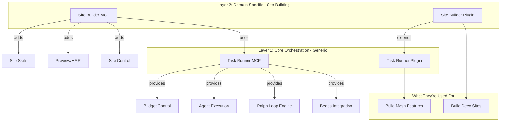

# Task Runner: Self-Hosted Agent Orchestration for Mesh

## Vision

Extract the core agent orchestration (Beads + Ralph loop) into a **generic Task Runner MCP** that can be used to build ANY feature - including itself. Bootstrap the system: use Task Runner to build Site Builder, then use Site Builder to build landing pages.

**Goal:** Make closed-loop agent development the normal workflow for the team.

## Separation of Concerns



## The Two MCPs

### 1. Task Runner MCP (Generic)

Location: `mcps/task-runner/`

**What it does:**
- Beads CLI integration (task storage, dependencies)
- Ralph-style execution loop
- Agent calling (Claude CLI or API)
- Budget/iteration control
- Skill loading and execution
- Progress streaming

**Tools:**
```typescript
// Workspace management
WORKSPACE_SET        // Set working directory for all operations
WORKSPACE_GET        // Get current workspace

// Beads integration
BEADS_INIT           // bd init
BEADS_READY          // bd ready --json
BEADS_CREATE         // bd create "title" -p N
BEADS_UPDATE         // bd update <id> --status
BEADS_CLOSE          // bd close <id> --reason
BEADS_SYNC           // bd sync
BEADS_LIST           // bd list --tree --json

// Skills
SKILL_LIST           // List available skills
SKILL_GET            // Get skill details
SKILL_REGISTER       // Register a skill from file or inline

// Loop control
LOOP_START           // Start Ralph loop with config
LOOP_STATUS          // Get current iteration, task, spend
LOOP_PAUSE           // Pause execution
LOOP_RESUME          // Resume execution
LOOP_STOP            // Stop and cleanup

// Agent execution
AGENT_PROMPT         // Send prompt to agent, get streaming response
AGENT_STATUS         // Check if agent is running
```

**This MCP knows nothing about sites, previews, or stacks.** It's pure task orchestration.

### 2. Site Builder MCP (Domain-Specific)

Location: `mcps/site-builder/`

**What it does:**
- Site/folder management
- Dev server control (start, stop)
- Stack detection (Deco, Next.js, etc.)
- Preview URL management
- Site-specific skills

**Tools:**
```typescript
// Site control
SITE_MOUNT           // Register folder as site
SITE_UNMOUNT         // Remove site
SITE_LIST            // List sites with status
SITE_START           // Start dev server
SITE_STOP            // Stop dev server
SITE_STATUS          // Get running state, port, URL
SITE_PAGES           // List available pages for preview

// Stack
STACK_DETECT         // Detect stack from config files
STACK_CONFIG         // Get stack-specific commands
```

**This MCP depends on Task Runner MCP for orchestration.** Skills registered here are site-specific.

## The Two Plugins

### 1. Task Runner Plugin (Generic)

Location: `packages/mesh-plugin-task-runner/`

**UI Components:**
- **Workspace Picker** - Select any folder to work on
- **Task Board** - Beads visualization (Blocked/Ready/In Progress/Done)
- **Skill Selector** - Pick or create skills
- **Agent Output Panel** - Streaming logs from agent
- **Budget Control** - Set limits, see spend
- **Loop Controls** - Start/Pause/Stop

**Layout:**
```
+------------------------------------------+------------------+
|           TASK RUNNER PLUGIN             |   MESH CHAT      |
+------------------------------------------+                  |
| Workspace: /Users/gui/Projects/mesh      |                  |
| [Change Workspace]                       |                  |
+------------------------------------------+                  |
| Skills: [Select Skill ▼] [+ New Skill]   |                  |
+------------------------------------------+                  |
| Tasks (Beads)           Budget: $5/$10   |                  |
| ┌─────────────────────────────────────┐  |                  |
| │ BLOCKED    READY     PROGRESS  DONE │  |                  |
| │ ┌──────┐  ┌──────┐  ┌──────┐  ┌───┐ │  |                  |
| │ │bd-01 │  │bd-02 │  │bd-03 │  │...│ │  |                  |
| │ └──────┘  │bd-04 │  └──────┘  └───┘ │  |                  |
| │           └──────┘                   │  |                  |
| └─────────────────────────────────────┘  |                  |
+------------------------------------------+                  |
| Agent Output                [Pause][Stop]|                  |
| ┌─────────────────────────────────────┐  |                  |
| │ > Creating MCP scaffold...          │  |                  |
| │ > Writing src/index.ts...           │  |                  |
| │ > <promise>COMPLETE</promise>       │  |                  |
| └─────────────────────────────────────┘  |                  |
+------------------------------------------+------------------+
```

### 2. Site Builder Plugin (Domain-Specific)

Location: `packages/mesh-plugin-site-builder/`

**Extends Task Runner Plugin with:**
- **Site List** - Mounted sites with status
- **Preview Panel** - iframe with HMR
- **Page Selector** - Dropdown of available pages
- **Site-specific skills** pre-registered

**Layout:**
```
+------------------------------------------+------------------+
|           SITE BUILDER PLUGIN            |   MESH CHAT      |
+------------------------------------------+                  |
| Sites [+ Add Folder]                     |                  |
| ┌────────────────────────────────────┐   |                  |
| │ > decocms/        [Running :8000]  │   |                  |
| │   vibegui.com/    [Stopped]        │   |                  |
| └────────────────────────────────────┘   |                  |
+------------------------------------------+                  |
| Preview  [/pitch/good-american ▼]        |                  |
| ┌─────────────────────────────────────┐  |                  |
| │                                     │  |                  |
| │    Live Preview (iframe)            │  |                  |
| │    localhost:8000                   │  |                  |
| │                                     │  |                  |
| └─────────────────────────────────────┘  |                  |
+------------------------------------------+                  |
| Tasks (from Task Runner)   Budget: $2.50 |                  |
| ┌─────────────────────────────────────┐  |                  |
| │ ○ bd-a3f8 Create hero section  [3] │  |                  |
| │ ◐ bd-a3f8.1 Add metrics       [1]  │  |                  |
| └─────────────────────────────────────┘  |                  |
+------------------------------------------+------------------+
```

## Bootstrap Workflow: Using Task Runner to Build Itself

### Step 1: Set Up Beads in mesh/ and mcps/

```bash
# Initialize Beads in mesh repo
cd ~/Projects/mesh
bd init

# Create epic for Task Runner
bd create "Task Runner MCP + Plugin" -t epic -p 0
# Returns: bd-abc

# Create sub-tasks
bd create "MCP scaffold with Beads tools" -p 1 --epic bd-abc
bd create "Ralph loop engine" -p 1 --epic bd-abc --blocked-by bd-abc.1
bd create "Task Runner Plugin UI" -p 1 --epic bd-abc --blocked-by bd-abc.2
# ... etc
```

### Step 2: Create Bootstrap Skill

Before we have the UI, create a skill file manually:

```typescript
// mcps/task-runner/skills/build-mcp.ts
export const buildMcpSkill: Skill = {
  id: "build-mcp",
  name: "Build MCP Server",
  description: "Create an MCP server with tools and resources",
  stack: ["*"],  // Any stack
  
  userStories: [
    {
      id: "US-001",
      title: "Create MCP scaffold",
      asA: "developer",
      iWant: "a working MCP server entry point",
      soThat: "I can add tools incrementally",
      acceptanceCriteria: [
        "package.json exists with @modelcontextprotocol/sdk dependency",
        "src/index.ts creates and starts MCP server",
        "Server responds to initialize request"
      ]
    },
    {
      id: "US-002",
      title: "Add first tool",
      asA: "developer", 
      iWant: "a working tool implementation",
      soThat: "I can verify the pattern works",
      acceptanceCriteria: [
        "Tool is registered in server",
        "Tool has Zod schema for input/output",
        "Tool can be called and returns expected result"
      ],
      dependsOn: ["US-001"]
    },
    // ... more stories
  ],
  
  qualityGates: {
    "*": ["bun run check", "bun run lint"]
  },
  
  prompts: {
    system: `You are building an MCP server for Mesh.
Follow patterns from existing MCPs in mcps/ folder.
Use @modelcontextprotocol/sdk for the server.
Use Zod for schema validation.`,
    taskTemplate: "...",
    acceptanceCriteria: "When complete, output: <promise>COMPLETE</promise>"
  }
};
```

### Step 3: Run Ralph Loop Manually (Bootstrap Phase)

Before we have the UI, run the loop via CLI:

```bash
# In mesh/ directory
# This is what Task Runner will automate

while true; do
  # Get next ready task
  TASK=$(bd ready --json | jq -r '.[0]')
  if [ -z "$TASK" ]; then
    echo "All tasks complete!"
    break
  fi
  
  # Build prompt from task
  PROMPT="Build this: $TASK. When done, output <promise>COMPLETE</promise>"
  
  # Call Claude
  echo "$PROMPT" | claude -p --cwd ~/Projects/mesh
  
  # Check for completion (manual for now)
  read -p "Task complete? (y/n): " COMPLETE
  if [ "$COMPLETE" = "y" ]; then
    bd close $(echo $TASK | jq -r '.id') --reason "Completed"
    bd sync
  fi
done
```

### Step 4: Once Task Runner Plugin Exists, Use It

Once the Task Runner plugin is built (by the bootstrap process above):

1. Open Mesh
2. Go to Task Runner plugin
3. Set workspace to `~/Projects/mesh`
4. Select "Build Site Builder" skill
5. Click "Run All"
6. Watch agents build the Site Builder feature
7. Budget controls prevent overspend

## File Structure

```
mcps/
├── task-runner/                    # Generic orchestration
│   ├── package.json
│   ├── src/
│   │   ├── index.ts               # MCP server entry
│   │   ├── tools/
│   │   │   ├── workspace.ts       # WORKSPACE_* tools
│   │   │   ├── beads.ts           # BEADS_* tools
│   │   │   ├── skills.ts          # SKILL_* tools
│   │   │   └── loop.ts            # LOOP_* tools
│   │   ├── engine/
│   │   │   ├── ralph-loop.ts      # Ralph execution loop
│   │   │   ├── completion.ts      # Completion detection
│   │   │   ├── quality-gates.ts   # Run quality commands
│   │   │   └── budget.ts          # Budget tracking
│   │   ├── agent/
│   │   │   ├── claude-cli.ts      # Claude Code CLI wrapper
│   │   │   └── api.ts             # Direct API calls (future)
│   │   └── skills/
│   │       ├── types.ts           # Skill interface
│   │       ├── registry.ts        # Skill registry
│   │       └── builtin/
│   │           ├── build-mcp.ts
│   │           ├── build-plugin.ts
│   │           └── build-feature.ts
│   
├── site-builder/                   # Site-specific
│   ├── package.json
│   ├── src/
│   │   ├── index.ts
│   │   ├── tools/
│   │   │   ├── site.ts            # SITE_* tools
│   │   │   └── stack.ts           # STACK_* tools
│   │   └── skills/
│   │       ├── landing-page.ts
│   │       ├── sales-pitch.ts
│   │       └── blog-post.ts

mesh/packages/
├── mesh-plugin-task-runner/        # Generic orchestration UI
│   ├── package.json
│   ├── index.tsx
│   ├── components/
│   │   ├── workspace-picker.tsx
│   │   ├── task-board.tsx
│   │   ├── skill-selector.tsx
│   │   ├── agent-output.tsx
│   │   ├── budget-control.tsx
│   │   └── loop-controls.tsx
│   └── lib/
│       ├── router.ts
│       └── binding.ts             # TASK_RUNNER_BINDING

├── mesh-plugin-site-builder/       # Site-specific UI
│   ├── package.json
│   ├── index.tsx
│   ├── components/
│   │   ├── site-list.tsx
│   │   ├── preview-frame.tsx
│   │   └── page-selector.tsx
│   └── lib/
│       ├── router.ts
│       └── binding.ts             # SITE_BUILDER_BINDING
```

## Skills for Building Mesh

Pre-built skills for common Mesh development tasks:

| Skill ID | Name | Description |
|----------|------|-------------|
| `build-mcp` | Build MCP Server | Create MCP with tools, resources, schemas |
| `build-plugin` | Build Mesh Plugin | Create React plugin with routing, components |
| `add-tool` | Add MCP Tool | Add a new tool to existing MCP |
| `add-component` | Add Plugin Component | Add a new component to existing plugin |
| `build-feature` | Build Feature | Full feature (MCP + Plugin + Integration) |
| `fix-bug` | Fix Bug | Investigate and fix a bug with tests |
| `add-tests` | Add Tests | Add tests for existing code |

## Implementation Phases

### Phase 0: Bootstrap (Manual - 1 day)

**Goal:** Get minimal Task Runner working to build itself

- [ ] Create `mcps/task-runner/` scaffold manually
- [ ] Implement `BEADS_*` tools (wrap bd CLI)
- [ ] Implement basic `LOOP_START` (single iteration)
- [ ] Create `build-mcp` skill
- [ ] Test: Can it complete one Beads task?

### Phase 1: Task Runner MCP (Using Bootstrap - 3 days)

**Goal:** Full Task Runner MCP, built by agents

- [ ] Set up Beads in mesh/ with epic + tasks
- [ ] Run bootstrap loop to build:
  - [ ] All BEADS_* tools
  - [ ] Ralph loop engine with completion detection
  - [ ] Quality gates execution
  - [ ] Budget tracking
  - [ ] SKILL_* tools
  - [ ] AGENT_* tools
- [ ] Verify: Can run 10 tasks to completion

### Phase 2: Task Runner Plugin (Using Task Runner - 3 days)

**Goal:** UI for Task Runner, built by Task Runner

- [ ] Create epic + tasks for plugin
- [ ] Run Task Runner to build:
  - [ ] Plugin scaffold with sidebar
  - [ ] Workspace picker component
  - [ ] Task board (Beads visualization)
  - [ ] Agent output streaming
  - [ ] Budget control UI
  - [ ] Loop controls
- [ ] Verify: Can use plugin to run tasks

### Phase 3: Site Builder (Using Task Runner - 3 days)

**Goal:** Site Builder MCP + Plugin, built by Task Runner

- [ ] Create epic + tasks for Site Builder
- [ ] Run Task Runner (via its own UI!) to build:
  - [ ] Site Builder MCP (site control, stack detection)
  - [ ] Site Builder Plugin (preview, site list)
  - [ ] Site-specific skills
- [ ] Verify: Can build a landing page with preview

### Phase 4: Team Workflow (Ongoing)

**Goal:** Make this the standard way to build features

- [ ] Document workflow for team
- [ ] Create skill templates
- [ ] Add iteration history and logs
- [ ] Add team features (assign tasks, notifications)

## How the Team Uses This

### Daily Workflow

1. **Create Feature Epic**
   ```bash
   bd create "Add user settings page" -t epic -p 1
   ```

2. **Break Down into Tasks**
   ```bash
   bd create "Settings API endpoint" --epic bd-xyz -p 1
   bd create "Settings React component" --epic bd-xyz -p 2 --blocked-by bd-xyz.1
   bd create "Integrate with sidebar" --epic bd-xyz -p 3 --blocked-by bd-xyz.2
   ```

3. **Open Mesh, Go to Task Runner**

4. **Set Workspace and Budget**
   - Workspace: `/Users/gui/Projects/mesh`
   - Budget: $10 or 20 iterations

5. **Select Skill** (or use "Generic Task")

6. **Click "Run All"**

7. **Monitor Progress**
   - Watch task board update
   - See agent output streaming
   - Pause if something looks wrong

8. **Review When Done**
   - All tasks in Beads marked complete
   - Code changes committed
   - Run `bd sync` to push

### Team Visibility

- Everyone can see task progress in Mesh
- Budget spent per feature tracked
- Agent output logs preserved
- Git history shows what agents did

## Success Criteria

1. **Bootstrap Success**: Task Runner can build the Task Runner Plugin
2. **Self-Hosting**: Task Runner Plugin can run tasks to build Site Builder
3. **Team Adoption**: Team uses Task Runner for feature development
4. **Budget Control**: No runaway spending, clear limits enforced
5. **Visibility**: Everyone can see what agents are doing
6. **Git Integration**: All work persisted in Beads, committed to git

## Key Differences from Original Plan

| Aspect | Original Plan | This Plan |
|--------|---------------|-----------|
| Scope | Site Builder only | Generic + Site Builder |
| Reusability | Site-specific | Any Mesh feature |
| Bootstrap | Manual build | Self-building |
| Team Use | Build sites | Build everything |
| Skills | Site skills only | MCP, Plugin, Feature skills |

## References

- [Ralph TUI](https://ralph-tui.com/) - Patterns for loop execution
- [Beads](https://github.com/steveyegge/beads) - Task storage and workflow
- [Beads UI](https://github.com/mantoni/beads-ui) - UI inspiration
- Original Site Builder plan: `mesh/SITE_BUILDER_PLAN.md`
