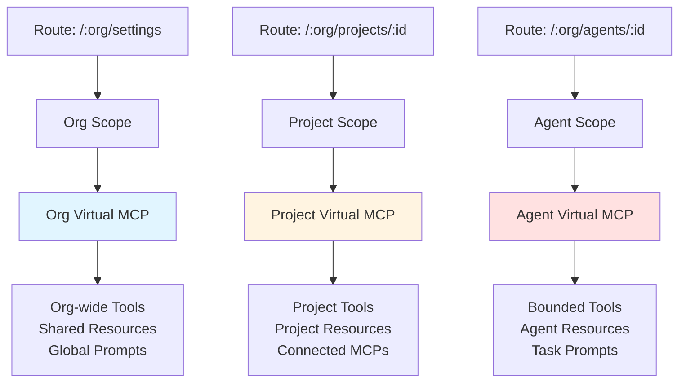
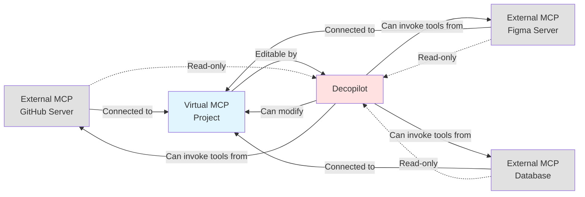
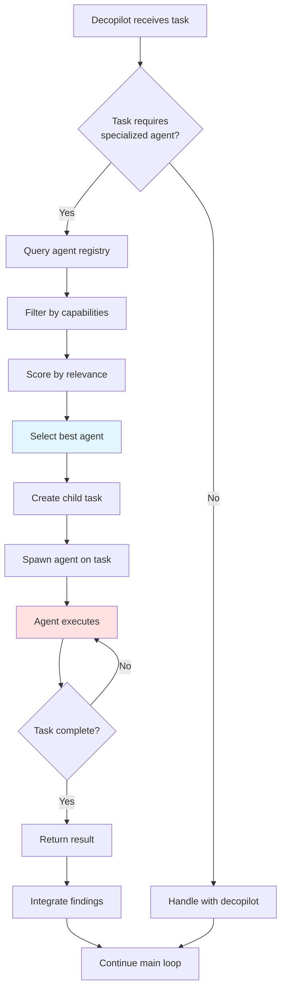
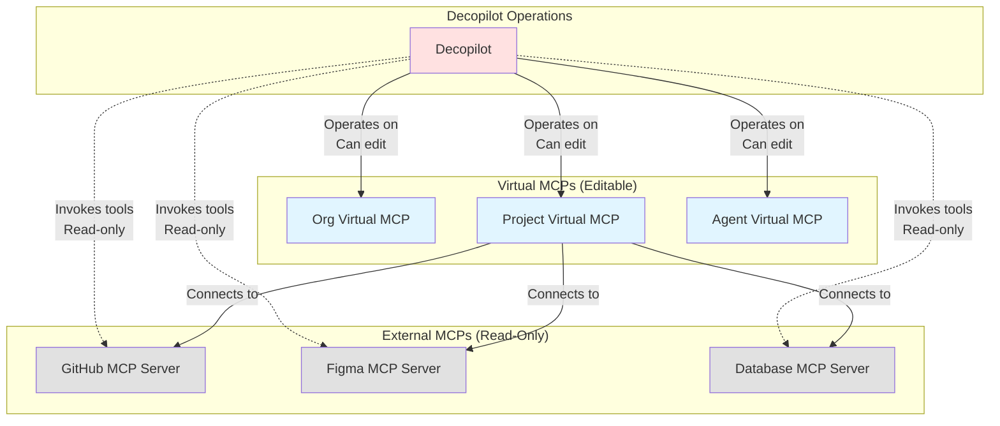
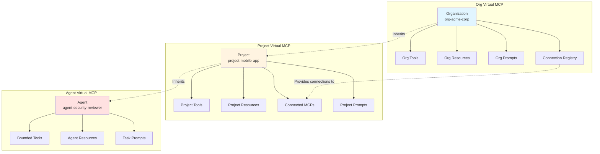
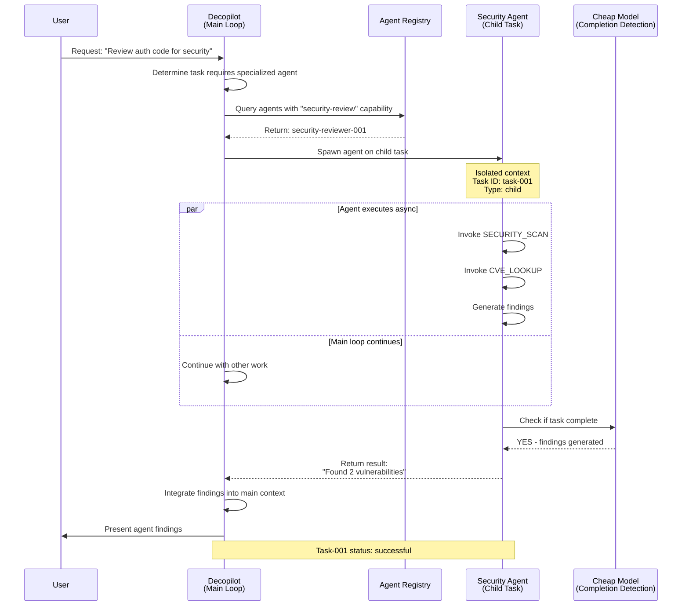

import Callout from "../../../../components/ui/Callout.astro";

<Callout type="info">
  This page documents the **planned architecture** for decopilot. The implementation is in development.
</Callout>

## Overview

Decopilot is an MCP-native AI agent that operates through a scope-sensitive architecture where **everything is a virtual MCP**. Unlike traditional AI coding assistants that work with local filesystems, decopilot is built from the ground up to operate on virtual MCPs—editable, configurable MCP servers that can be dynamically modified at runtime.

Decopilot operates through an **agentic loop**—gathering context from distributed MCP servers, taking coordinated actions, and verifying results—all while dynamically adapting based on scope. This continuous cycle enables autonomous workflows spanning multiple services, with decopilot orchestrating external MCPs (GitHub, Figma, Slack) while operating on editable virtual MCPs to reshape the environment as it works.

The architecture is fundamentally defined by three core principles:

**Scope-based operation**: Decopilot's behavior adapts based on the current route—operating in org scope (`/:org/settings`), project scope (`/:org/projects/:id`), or agent scope (`/:org/agents/:id`). Each scope corresponds to a different virtual MCP with distinct capabilities.

**Virtual MCP foundation**: Organizations, projects, and agents are all virtual MCPs. This isn't just an implementation detail—it's the architectural constraint that enables decopilot's dynamic capabilities.

**Task-based execution model**: Decopilot spawns agents on specific tasks with isolated contexts, enabling parallel work and focused execution without context pollution.

This architecture enables decopilot to dynamically reshape the environment as it works, adding tools, creating resources, and configuring capabilities on the fly—operations that are only possible with editable virtual MCPs.

## The Agentic Loop in Practice

Decopilot's agentic loop—**gather → act → verify**—maps directly to the architecture, showing how system components enable autonomous workflows.

### Gather Context Phase

Decopilot gathers context through built-in tools that query the current scope's virtual MCP and connected external MCPs:

- **`tools_search`**: Discovers available tools from virtual MCP and external connections
- **`resource_read`**: Loads project documentation, architecture decisions, guidelines
- **`tools_read`**: Inspects tool specifications to understand capabilities
- **External MCP queries**: Invokes tools from GitHub (branch status), Figma (design specs), databases (data state)

**Architecture insight**: The scope determines which virtual MCP is queried and which external MCPs are accessible. Project scope provides project-specific context; agent scope provides bounded, focused context.

### Take Action Phase

Decopilot takes action by:

- **Enabling and invoking external MCP tools**: `tool_enable` followed by tool invocation (CREATE_PR, EXPORT_ASSETS, SEND_MESSAGE)
- **Creating resources**: `resource_edit` to document decisions, findings, or generate artifacts
- **Creating inline tools**: `tools_edit` to add project-specific capabilities dynamically
- **Spawning agents**: `agent_spawn` to delegate specialized work with isolated context

**Architecture insight**: Virtual MCPs are editable, enabling decopilot to create tools and resources on the fly. External MCPs provide read-only tool access—decopilot invokes but doesn't modify them.

### Verify Results Phase

Decopilot verifies outcomes through:

- **Tool response checking**: Confirms successful execution and validates return values
- **Agent spawning for verification**: Spawns review agents (security, performance, quality) to validate work
- **Resource creation**: Documents findings and results for future reference
- **Status reporting**: Determines next actions based on verification results

**Architecture insight**: Agent spawning provides fresh context for verification without polluting the main loop. Results integrate as summaries (~200-500 tokens), not full conversations.

### Complete Loop Example

```typescript
// User request in project scope
User: "Create a PR for the auth feature"

// GATHER: Check current state
const branch = await GIT_BRANCH_STATUS({ repo: "mobile-app" })
const commits = await GIT_LOG({ repo: "mobile-app", limit: 5 })

// ACT: Create PR
await tool_enable({ tool_name: "CREATE_PR" })
const pr = await CREATE_PR({
  title: "Add biometric authentication",
  body: "Implements face ID and fingerprint auth",
  base: "main",
  head: "feature/biometric-auth"
})

// VERIFY: Spawn security agent for review
await agent_spawn({
  agent_id: "security-reviewer",
  prompt: `Review PR #${pr.number} for security issues`
})

// Loop continues: integrate findings, update PR if needed
```

**Key architectural benefit**: The agentic loop operates seamlessly across distributed MCP servers (via HTTP or stdio). Each phase leverages virtual MCPs for editability and external MCPs for domain-specific capabilities.

## Architectural Constraint: Virtual MCPs Only

Decopilot has a fundamental architectural constraint: **it only works with virtual MCPs**. This constraint exists for a critical reason—decopilot needs to operate on and edit the MCP configurations dynamically.

### Why This Constraint Exists

Traditional MCP servers (external servers like GitHub, Slack, or database MCPs) are **read-only connections** from decopilot's perspective. These servers expose a fixed set of tools through the MCP protocol, but their configuration cannot be modified by clients. Decopilot can invoke their tools, but it cannot add new tools, create resources, or update prompts on these servers.

Virtual MCPs, by contrast, are **editable and configurable**. When decopilot operates in a project scope, that project IS a virtual MCP that decopilot can modify. This means decopilot can:

- Add new tools to the current context
- Create documentation resources as it works
- Update prompts based on workflow patterns
- Configure connections dynamically
- Modify the virtual MCP structure itself

Without this editability, decopilot would be limited to using predefined tools—essentially a chatbot with access to APIs. The virtual MCP constraint enables decopilot to be an active participant in shaping the environment, not just consuming it.

### What This Means

The constraint means that **every context decopilot operates in must be a virtual MCP**:

- **Organization scope** (`/:org/settings`): The organization itself is a virtual MCP
- **Project scope** (`/:org/projects/:id`): Each project is a virtual MCP
- **Agent scope** (`/:org/agents/:id`): Each agent is a virtual MCP

External MCP servers (GitHub, Slack, databases) are connected TO these virtual MCPs, not operated on BY decopilot. Decopilot uses the tools from external MCPs, but it operates on the virtual MCP that aggregates them.

```typescript
// External MCP: read-only from decopilot's perspective
const githubMCP = {
  tools: ["CREATE_PR", "LIST_ISSUES"], // Fixed toolset
  // Decopilot can invoke these tools but cannot modify this server
}

// Virtual MCP: editable by decopilot
const projectVirtualMCP = {
  connections: [githubMCP], // Compose external MCPs
  tools: ["DEPLOY_STAGING"], // Inline tools decopilot can add/remove
  resources: [], // Resources decopilot can create
  prompts: [], // Prompts decopilot can update
  // Decopilot can modify this structure dynamically
}
```

### Benefits

This architectural constraint provides:

**Dynamic tool management**: Decopilot can add tools to the current scope as needed, creating workflows on the fly rather than requiring pre-configuration.

**Resource creation**: As decopilot works, it can create documentation resources, guidelines, and context that persist in the virtual MCP for future use.

**Prompt evolution**: Decopilot can update prompt templates based on successful patterns, continuously improving the virtual MCP.

**Composable capabilities**: External MCPs remain isolated and secure, while virtual MCPs provide the editable layer that composes them.

**Clear separation of concerns**: External MCPs focus on providing stable, secure tools. Virtual MCPs focus on dynamic aggregation and configuration.

The constraint turns a potential limitation into a powerful architectural pattern—by requiring virtual MCPs, decopilot gains the editability foundation that makes its dynamic behavior possible.

## The Virtual MCP Foundation

At the core of decopilot's architecture is a simple but powerful concept: **everything is a virtual MCP**. Organizations, projects, and agents are all virtual MCP servers with tools, resources, prompts, and configuration.

### Organizations as Virtual MCPs

When you operate in org scope (`/:org/settings` or `/:org/connections`), you're working within the organization's virtual MCP. This virtual MCP contains:

- **Organization-wide tools**: Capabilities available across all projects and agents
- **Shared resources**: Guidelines, policies, documentation that apply org-wide
- **Global prompts**: Templates and workflows for the entire organization
- **Connection registry**: All external MCP connections managed at the org level

The organization virtual MCP serves as the foundation layer, comparable to `~/.claude/` in Claude Code—the global context that underlies all work.

```typescript
// Organization virtual MCP structure
{
  "organizationId": "acme-corp",
  "virtualMCPId": "org-acme-corp",
  "tools": [
    "ORG_CONNECTION_CREATE",
    "ORG_RESOURCE_CREATE",
    "ORG_PROMPT_UPDATE"
  ],
  "resources": [
    {
      "uri": "org://acme-corp/security-policy",
      "name": "Security Policy",
      "mimeType": "text/markdown"
    },
    {
      "uri": "org://acme-corp/coding-standards",
      "name": "Coding Standards",
      "mimeType": "text/markdown"
    }
  ],
  "connections": ["github-conn-123", "slack-conn-456"]
}
```

### Projects as Virtual MCPs

Projects ARE virtual MCPs, not containers for other resources. Each project (`/:org/projects/:id`) is a self-contained virtual MCP server with its own capabilities:

- **Project-specific tools**: Inline tools or composed from connected MCPs
- **Project resources**: Documentation, architecture diagrams, guidelines
- **Project prompts**: Custom templates for the project's workflows
- **Project connections**: External MCPs wired to this project's scope

Projects are the primary organizational unit for work, comparable to `.claude/` in Claude Code—the project-local context that isolates work.

```typescript
// Project virtual MCP structure
{
  "projectId": "mobile-app-rewrite",
  "virtualMCPId": "project-mobile-app-rewrite",
  "organizationId": "acme-corp",
  "connections": [
    {
      "connectionId": "github-conn-123",
      "tools": ["CREATE_PR", "LIST_ISSUES"]
    },
    {
      "connectionId": "figma-conn-456",
      "tools": ["GET_DESIGN", "EXPORT_ASSETS"]
    }
  ],
  "tools": [
    {
      "name": "DEPLOY_STAGING",
      "description": "Deploy mobile app to staging environment",
      "inputSchema": {/* ... */}
    }
  ],
  "resources": [
    {
      "uri": "project://mobile-app-rewrite/architecture",
      "name": "Mobile Architecture",
      "mimeType": "text/markdown"
    }
  ],
  "prompts": [
    {
      "name": "mobile-pr-template",
      "description": "PR template for mobile features",
      "template": "## Mobile Feature PR\n\n{{description}}"
    }
  ]
}
```

### Agents as Virtual MCPs

Agents ARE virtual MCPs optimized for single-purpose tasks. Each agent (`/:org/agents/:id`) is a focused virtual MCP with:

- **Bounded tools**: Limited toolset specific to the agent's purpose
- **Agent-specific resources**: Documentation and context for the agent's task
- **Task prompts**: Specialized templates for the agent's workflows
- **Single-purpose focus**: Narrow scope ensures predictable, repeatable behavior

Agents are the most focused scope level, providing specialized capabilities for well-defined tasks.

```typescript
// Agent virtual MCP structure
{
  "agentId": "security-reviewer-001",
  "virtualMCPId": "agent-security-reviewer-001",
  "organizationId": "acme-corp",
  "purpose": "Review code for security vulnerabilities",
  "tools": [
    {
      "name": "SECURITY_SCAN",
      "description": "Scan code for security issues"
    },
    {
      "name": "CVE_LOOKUP",
      "description": "Look up known vulnerabilities"
    }
  ],
  "resources": [
    {
      "uri": "agent://security-reviewer-001/checklist",
      "name": "Security Review Checklist",
      "mimeType": "text/markdown"
    }
  ],
  "prompts": [
    {
      "name": "security-analysis",
      "description": "Analyze code for security issues",
      "template": "Review this code for:\n- SQL injection\n- XSS\n- Auth bypasses\n\nCode:\n{{code}}"
    }
  ]
}
```

### Virtual MCP Hierarchy

Virtual MCPs form a hierarchy where capabilities flow from org to project to agent:

- **Org virtual MCP**: Foundation layer, provides org-wide capabilities
- **Project virtual MCP**: Inherits org capabilities, adds project-specific tools
- **Agent virtual MCP**: Most focused, bounded toolset for specific task

This hierarchy ensures consistency while enabling specialization at each level.

## Scope-Based Architecture

Decopilot's behavior is determined by **scope**—the current virtual MCP context in which it operates. Scope is automatically determined by the route, and as you navigate through the application, decopilot seamlessly adapts to the new context.

### Route-Based Scope Determination

The route determines which virtual MCP decopilot operates on:

```typescript
// Route-to-scope mapping
const SCOPE_ROUTES = {
  // Organization scope
  "/:org/settings": {
    scopeType: "org",
    virtualMCPId: "org-{orgId}"
  },
  "/:org/connections": {
    scopeType: "org",
    virtualMCPId: "org-{orgId}"
  },

  // Project scope
  "/:org/projects/:projectId": {
    scopeType: "project",
    virtualMCPId: "project-{projectId}"
  },
  "/:org/projects/:projectId/settings": {
    scopeType: "project",
    virtualMCPId: "project-{projectId}"
  },

  // Agent scope
  "/:org/agents/:agentId": {
    scopeType: "agent",
    virtualMCPId: "agent-{agentId}"
  },
  "/:org/agents/:agentId/config": {
    scopeType: "agent",
    virtualMCPId: "agent-{agentId}"
  }
}

// Route parsing determines scope
function getScopeFromRoute(route: string) {
  const match = matchRoute(route, SCOPE_ROUTES)
  if (!match) throw new Error("Invalid route")

  return {
    scopeType: match.scopeType,
    virtualMCPId: match.virtualMCPId,
    params: match.params
  }
}
```

### Scope Characteristics

Each scope type has distinct characteristics:

**Org Scope**:
- **Breadth**: Organization-wide capabilities
- **Tools**: Connection management, org resource creation, global configuration
- **Resources**: Security policies, coding standards, org guidelines
- **Behavior**: Operates like an org-admin, managing shared infrastructure

**Project Scope**:
- **Breadth**: Project-specific capabilities
- **Tools**: Project tools + composed from connected MCPs (GitHub, Figma, etc.)
- **Resources**: Project documentation, architecture diagrams, guidelines
- **Behavior**: Focused on project work, isolated from other projects

**Agent Scope**:
- **Breadth**: Task-specific capabilities
- **Tools**: Bounded toolset for the agent's single purpose
- **Resources**: Agent-specific checklists and context
- **Behavior**: Highly focused, predictable execution for well-defined tasks

### Scope Diagram



## How Decopilot Operates

Decopilot's operation changes based on the current scope. Each scope provides a different virtual MCP for decopilot to operate on, and the available tools, resources, and behavior adapt accordingly.

### Operating in Org Scope

In org scope (`/:org/settings`, `/:org/connections`), decopilot has access to organization-wide capabilities:

```typescript
// Org scope operations
const orgScope = {
  virtualMCPId: "org-acme-corp",

  availableTools: [
    "ORG_CONNECTION_CREATE",    // Add external MCP connections
    "ORG_RESOURCE_CREATE",      // Create org-wide resources
    "ORG_PROMPT_UPDATE",        // Update global prompts
    "ORG_PROJECT_CREATE"        // Create new projects
  ],

  availableResources: [
    "org://acme-corp/security-policy",
    "org://acme-corp/coding-standards",
    "org://acme-corp/deployment-guide"
  ]
}

// Example: Creating an org-wide resource
decopilot.invokeTool("ORG_RESOURCE_CREATE", {
  uri: "org://acme-corp/api-guidelines",
  name: "API Design Guidelines",
  content: "# API Guidelines\n\n- RESTful design\n- Versioning strategy\n..."
})
```

### Operating in Project Scope

In project scope (`/:org/projects/:projectId`), decopilot operates on the project's virtual MCP:

```typescript
// Project scope operations
const projectScope = {
  virtualMCPId: "project-mobile-app-rewrite",

  availableTools: [
    // From connected GitHub MCP
    "CREATE_PR",
    "LIST_ISSUES",
    "CREATE_BRANCH",

    // From connected Figma MCP
    "GET_DESIGN",
    "EXPORT_ASSETS",

    // Inline project tools
    "DEPLOY_STAGING",
    "RUN_MOBILE_TESTS"
  ],

  availableResources: [
    "project://mobile-app-rewrite/architecture",
    "project://mobile-app-rewrite/testing-guide",
    // Also inherits org resources
    "org://acme-corp/security-policy"
  ]
}

// Example: Creating a PR using project's GitHub connection
decopilot.invokeTool("CREATE_PR", {
  title: "Add biometric authentication",
  body: "Implements face ID and fingerprint authentication for iOS and Android",
  base: "main",
  head: "feature/biometric-auth"
})
```

### Operating in Agent Scope

In agent scope (`/:org/agents/:agentId`), decopilot operates on the agent's bounded virtual MCP:

```typescript
// Agent scope operations
const agentScope = {
  virtualMCPId: "agent-security-reviewer-001",

  availableTools: [
    "SECURITY_SCAN",           // Bounded to agent's purpose
    "CVE_LOOKUP",
    "GENERATE_SECURITY_REPORT"
  ],

  availableResources: [
    "agent://security-reviewer-001/checklist",
    "agent://security-reviewer-001/patterns",
    // Also inherits org and project resources if spawned in project context
    "org://acme-corp/security-policy"
  ]
}

// Example: Running security scan with agent's tools
decopilot.invokeTool("SECURITY_SCAN", {
  code: "SELECT * FROM users WHERE id = " + userId,
  language: "sql"
})
```

### Scope Inheritance

Scopes inherit capabilities from their parent levels:

- **Agent scope** inherits from project scope (if spawned in project) and org scope
- **Project scope** inherits from org scope
- **Org scope** is the foundation level

This inheritance ensures consistency while enabling specialization.

## External MCP Servers vs Virtual MCPs

Understanding the distinction between external MCP servers and virtual MCPs is crucial to decopilot's architecture.

### External MCP Servers

External MCP servers are traditional MCP servers that expose tools through the MCP protocol:

**Characteristics**:
- Fixed toolset defined by server implementation
- Cannot be modified by clients
- Provide stable, secure access to external systems
- Examples: GitHub MCP, Slack MCP, database MCPs

**From decopilot's perspective**:
- **Read-only**: Can invoke tools but cannot modify the server
- **Consumed, not operated on**: Used for their capabilities, not edited
- **Connected TO virtual MCPs**: Aggregated into virtual MCPs for use

```typescript
// External MCP server (GitHub)
const githubMCP = {
  serverUrl: "https://github-mcp.example.com",
  tools: [
    "CREATE_PR",
    "LIST_ISSUES",
    "CREATE_BRANCH",
    "MERGE_PR"
  ],
  // This toolset is fixed and cannot be modified by decopilot
}
```

### Virtual MCPs

Virtual MCPs are editable, configurable MCP servers managed by decocms:

**Characteristics**:
- Dynamic toolset that can be modified at runtime
- Can aggregate tools from multiple external MCPs
- Can define inline tools, resources, and prompts
- Fully MCP-compliant endpoints

**From decopilot's perspective**:
- **Editable**: Can add tools, create resources, update prompts
- **Operated on**: Decopilot modifies the virtual MCP as it works
- **Compose external MCPs**: Aggregate capabilities from external servers

```typescript
// Virtual MCP (project)
const projectVirtualMCP = {
  virtualMCPId: "project-mobile-app-rewrite",

  // Composed external MCPs
  connections: [
    {
      connectionId: "github-conn-123",
      tools: ["CREATE_PR", "LIST_ISSUES"] // Selected from external MCP
    },
    {
      connectionId: "figma-conn-456",
      tools: ["GET_DESIGN"] // Selected from external MCP
    }
  ],

  // Inline tools (editable by decopilot)
  tools: [
    {
      name: "DEPLOY_STAGING",
      description: "Deploy to staging environment",
      handler: async (input) => {/* ... */}
    }
  ],

  // Resources (created by decopilot)
  resources: [
    {
      uri: "project://mobile-app-rewrite/architecture",
      name: "Architecture Documentation",
      content: "# Architecture\n\n..."
    }
  ]
}
```

### Interaction Pattern

External MCPs and virtual MCPs interact through composition:

```typescript
// External MCP connection to virtual MCP
const externalToVirtual = {
  // 1. Connect external MCP to decocms
  externalMCP: {
    id: "github-conn-123",
    serverUrl: "https://github-mcp.example.com",
    tools: ["CREATE_PR", "LIST_ISSUES", "CREATE_BRANCH", "MERGE_PR"]
  },

  // 2. Compose into virtual MCP (select tools)
  virtualMCP: {
    id: "project-mobile-app-rewrite",
    connections: [
      {
        connectionId: "github-conn-123",
        tools: ["CREATE_PR", "LIST_ISSUES"] // Subset of external MCP tools
      }
    ]
  },

  // 3. Decopilot operates on virtual MCP
  // - Can invoke CREATE_PR (from external MCP)
  // - Can add new inline tools to virtual MCP
  // - Cannot modify github-conn-123 (external MCP)
}
```

### Why This Separation Matters

**Security**: External MCPs remain isolated and secure. Decopilot cannot modify their configuration or access unauthorized tools.

**Flexibility**: Virtual MCPs can be edited dynamically, enabling decopilot to reshape the environment without touching external infrastructure.

**Composition**: Multiple external MCPs can be aggregated into a single virtual MCP, providing unified access.

**Clear boundaries**: External MCPs are stable, production systems. Virtual MCPs are dynamic, configurable contexts.

### Diagram: External vs Virtual MCPs



## Task-Based Agent Spawning

Decopilot uses a task-based execution model where agents are spawned on specific tasks with isolated contexts. This enables parallel work, focused execution, and clear separation of concerns.

### Task System Overview

The task system (also called the thread system—terminology is migrating from "tasks" to "threads") manages asynchronous agent execution:

**Task types**:
- **Top-level tasks**: Initiated by users, represent primary work threads
- **Child tasks**: Spawned by agents or decopilot, represent sub-tasks

**Task states**:
- **Active**: Task is currently being processed
- **Needs Input**: Task requires user input to continue
- **Successful**: Task completed successfully
- **Failed**: Task encountered an error

### Spawning Agents on Tasks

When decopilot spawns an agent, it creates a new task with isolated context:

```typescript
// Task-based agent spawning
const spawnAgentTask = {
  // Spawn agent on specific task
  taskId: "task-001",
  taskType: "child", // Spawned by parent (user or decopilot)

  agentId: "security-reviewer-001",
  instruction: "Review authentication implementation for security vulnerabilities",

  context: {
    // Isolated context for this task
    projectId: "mobile-app-rewrite",
    files: ["src/auth/login.ts", "src/auth/session.ts"],
    scope: "project" // Agent runs in project scope
  },

  // Task runs until agent responds
  status: "active"
}

// Agent executes in isolated context
// Returns result when complete
const result = await agent.execute(spawnAgentTask)

// Main decopilot loop continues
decopilot.continue()
```

### Task Isolation

Each task has isolated context:

```typescript
// Task context isolation
const taskContext = {
  taskId: "task-001",

  // Isolated conversation history
  messages: [
    { role: "user", content: "Review this authentication code" },
    { role: "agent", content: "Analyzing authentication implementation..." }
  ],

  // Isolated tool invocations
  toolInvocations: [
    { tool: "SECURITY_SCAN", input: {/* ... */}, output: {/* ... */} }
  ],

  // Task-specific state
  state: "active",

  // Parent task reference (if child task)
  parentTaskId: "task-root"
}
```

### Tool Availability Per Task Type

Different task types have different tool availability:

**Top-level tasks** (user-initiated):
- Full tool access
- Can use `user_ask_question` to prompt user for input
- Can spawn child tasks

**Child tasks** (agent-spawned):
- Bounded tool access
- **Cannot use `user_ask_question`** (no user interaction)
- Can spawn grandchild tasks (nested execution)

```typescript
// Tool availability per task type
const taskTypeTools = {
  topLevel: {
    availableTools: [
      "CREATE_PR",
      "SECURITY_SCAN",
      "user_ask_question", // User interaction allowed
      "spawn_agent"
    ]
  },

  child: {
    availableTools: [
      "CREATE_PR",
      "SECURITY_SCAN",
      // "user_ask_question" DISABLED - no user interaction
      "spawn_agent" // Can spawn grandchild tasks
    ]
  }
}
```

### Completion Detection

A cheap AI model detects task completion:

```typescript
// Completion detection with cheap model
const detectCompletion = async (task: Task) => {
  const prompt = `
Has this task completed its objective?

Task: ${task.instruction}

Conversation:
${task.messages.map(m => `${m.role}: ${m.content}`).join("\n")}

Tool invocations:
${task.toolInvocations.map(t => `${t.tool}: ${t.output}`).join("\n")}

Answer: YES or NO
`

  const response = await cheapModel.complete(prompt)

  if (response.includes("YES")) {
    task.status = "successful"
  }
}
```

### UI Integration

Tasks map to the UI as threads:

- **Tasks menu**: Lists all tasks (threads), with status indicators
- **Task detail view**: Shows conversation history for a specific task (thread)
- **Active task indicator**: Shows which task is currently being processed

```typescript
// UI representation of tasks
const tasksUI = {
  taskList: [
    {
      taskId: "task-001",
      title: "Review authentication security",
      status: "successful",
      type: "child",
      agentId: "security-reviewer-001"
    },
    {
      taskId: "task-002",
      title: "Implement biometric auth",
      status: "active",
      type: "topLevel",
      agentId: null // User task, no agent
    },
    {
      taskId: "task-003",
      title: "Deploy to staging",
      status: "needs_input",
      type: "topLevel",
      agentId: null
    }
  ],

  // Task detail = chat interface
  taskDetail: {
    taskId: "task-001",
    messages: [/* conversation history */],
    toolInvocations: [/* tools executed */]
  }
}
```

### Async Execution Model

Task-based spawning enables asynchronous execution:

1. **Decopilot spawns agent on task**: Creates child task with isolated context
2. **Agent executes until complete**: Runs in background, no blocking
3. **Main decopilot loop continues**: Can work on other tasks in parallel
4. **Task completion**: Agent returns result, main loop integrates findings

This model enables parallel work and ensures the main decopilot context remains clean.

## Agent Selection

When spawning agents, decopilot can select from any agent configured in your organization. Agents are single-purpose virtual MCPs optimized for specific tasks.

### Agent Registry

Organizations maintain a registry of available agents:

```typescript
// Organization agent registry
const agentRegistry = {
  organizationId: "acme-corp",

  agents: [
    {
      agentId: "security-reviewer-001",
      name: "Security Reviewer",
      purpose: "Review code for security vulnerabilities",
      virtualMCPId: "agent-security-reviewer-001",
      tools: ["SECURITY_SCAN", "CVE_LOOKUP"],
      capabilities: ["security-review", "vulnerability-analysis"]
    },
    {
      agentId: "performance-analyzer-002",
      name: "Performance Analyzer",
      purpose: "Analyze code for performance issues",
      virtualMCPId: "agent-performance-analyzer-002",
      tools: ["PROFILE_CODE", "DETECT_N_PLUS_ONE"],
      capabilities: ["performance-analysis", "profiling"]
    },
    {
      agentId: "documentation-writer-003",
      name: "Documentation Writer",
      purpose: "Generate and update documentation",
      virtualMCPId: "agent-documentation-writer-003",
      tools: ["GENERATE_DOCS", "UPDATE_README"],
      capabilities: ["documentation", "technical-writing"]
    }
  ]
}
```

### Agent Selection Criteria

Decopilot selects agents based on task requirements:

```typescript
// Agent selection based on task
const selectAgent = (task: {
  instruction: string
  requiredCapabilities: string[]
  context: object
}) => {
  // Filter agents by required capabilities
  const eligibleAgents = agentRegistry.agents.filter(agent =>
    task.requiredCapabilities.every(cap =>
      agent.capabilities.includes(cap)
    )
  )

  // Score agents by relevance
  const scoredAgents = eligibleAgents.map(agent => ({
    agent,
    score: calculateRelevance(agent, task)
  }))

  // Select best match
  const selectedAgent = scoredAgents.sort((a, b) => b.score - a.score)[0]

  return selectedAgent.agent
}

// Example: Select security reviewer for auth task
const agent = selectAgent({
  instruction: "Review authentication implementation",
  requiredCapabilities: ["security-review"],
  context: { files: ["src/auth/login.ts"] }
})
// Returns: security-reviewer-001
```

### Single-Purpose Virtual MCPs

Agents are virtual MCPs with bounded, focused capabilities:

**Characteristics**:
- **Single purpose**: Each agent optimized for one type of task
- **Bounded tools**: Limited toolset prevents scope creep
- **Predictable behavior**: Narrow focus ensures consistent results
- **Reusable**: Agents can be spawned on multiple tasks

```typescript
// Agent as single-purpose virtual MCP
const securityReviewerAgent = {
  agentId: "security-reviewer-001",
  virtualMCPId: "agent-security-reviewer-001",

  // Bounded toolset
  tools: [
    "SECURITY_SCAN",
    "CVE_LOOKUP",
    "GENERATE_SECURITY_REPORT"
  ],

  // Focused resources
  resources: [
    {
      uri: "agent://security-reviewer-001/owasp-top-10",
      name: "OWASP Top 10 Checklist"
    },
    {
      uri: "agent://security-reviewer-001/patterns",
      name: "Security Anti-patterns"
    }
  ],

  // Specialized prompts
  prompts: [
    {
      name: "security-analysis",
      template: "Analyze for: SQL injection, XSS, auth bypasses\n\nCode:\n{{code}}"
    }
  ]
}
```

### Agent Spawning Flow



## Dynamic Virtual MCP Features

Virtual MCPs are dynamically configurable, enabling decopilot to reshape the environment as it works. This is the core capability that differentiates decopilot from traditional AI assistants.

### Inline Prompts

Decopilot can create and update prompts within the current virtual MCP:

```typescript
// Creating an inline prompt
decopilot.invokeTool("VIRTUAL_MCP_ADD_PROMPT", {
  name: "mobile-pr-checklist",
  description: "Checklist for mobile feature PRs",
  template: `
## Mobile Feature PR Checklist

### Testing
- [ ] iOS device tested
- [ ] Android device tested
- [ ] Tablet layouts verified
- [ ] Dark mode tested

### Performance
- [ ] Bundle size impact measured
- [ ] Load time profiled
- [ ] Memory usage checked

### Accessibility
- [ ] Screen reader tested
- [ ] Keyboard navigation verified
- [ ] Color contrast validated

Description:
{{description}}
  `.trim()
})

// Using the prompt later
decopilot.invokePrompt("mobile-pr-checklist", {
  description: "Add biometric authentication"
})
```

### Inline Resources

Decopilot can create resources that persist in the virtual MCP:

```typescript
// Creating a resource as decopilot works
decopilot.invokeTool("VIRTUAL_MCP_ADD_RESOURCE", {
  uri: "project://mobile-app-rewrite/auth-architecture",
  name: "Authentication Architecture",
  mimeType: "text/markdown",
  content: `
# Authentication Architecture

## Overview
The mobile app uses biometric authentication with fallback to PIN/password.

## Components
- BiometricAuthManager: Handles face ID / fingerprint
- SessionManager: Manages auth sessions
- TokenStore: Secure storage for tokens

## Flow
1. User attempts login
2. BiometricAuthManager checks availability
3. If available, prompt for biometric
4. If successful, generate session token
5. SessionManager stores token
  `.trim()
})

// Resource is now available in project scope
decopilot.readResource("project://mobile-app-rewrite/auth-architecture")
```

### Inline Tools

Decopilot can define new tools within the virtual MCP:

```typescript
// Defining an inline tool
decopilot.invokeTool("VIRTUAL_MCP_ADD_TOOL", {
  name: "MOBILE_TEST_ALL_PLATFORMS",
  description: "Run tests on iOS and Android simulators",
  inputSchema: {
    type: "object",
    properties: {
      testSuite: {
        type: "string",
        enum: ["unit", "integration", "e2e"]
      }
    }
  },
  implementation: {
    type: "composite", // Orchestrates other tools
    steps: [
      {
        tool: "RUN_TESTS",
        input: {
          platform: "ios",
          suite: "{{testSuite}}"
        }
      },
      {
        tool: "RUN_TESTS",
        input: {
          platform: "android",
          suite: "{{testSuite}}"
        }
      }
    ]
  }
})

// Tool is now available in project scope
decopilot.invokeTool("MOBILE_TEST_ALL_PLATFORMS", {
  testSuite: "integration"
})
```

### Extensibility Pattern

The dynamic features follow a consistent pattern:

1. **Identify need**: Decopilot recognizes a recurring pattern or missing capability
2. **Create inline feature**: Add prompt, resource, or tool to virtual MCP
3. **Persist in scope**: Feature becomes part of the virtual MCP configuration
4. **Reuse**: Feature available for future operations in this scope

```typescript
// Extensibility pattern example
const workflowPattern = {
  // 1. Identify need
  observation: "Creating mobile PRs requires same checklist every time",

  // 2. Create inline feature
  action: {
    tool: "VIRTUAL_MCP_ADD_PROMPT",
    input: {
      name: "mobile-pr-checklist",
      template: "{{checklist}}"
    }
  },

  // 3. Persist in scope
  result: "Prompt added to project virtual MCP",

  // 4. Reuse
  nextTime: "Use mobile-pr-checklist prompt for all mobile PRs"
}
```

### Editing Current Virtual MCP

Decopilot always operates on the **current scope's virtual MCP**:

```typescript
// Current scope determines which virtual MCP is edited
const editCurrentVirtualMCP = (scope: Scope) => {
  // In project scope: edit project virtual MCP
  if (scope.type === "project") {
    editVirtualMCP(scope.virtualMCPId) // project-mobile-app-rewrite
  }

  // In agent scope: edit agent virtual MCP
  if (scope.type === "agent") {
    editVirtualMCP(scope.virtualMCPId) // agent-security-reviewer-001
  }

  // In org scope: edit org virtual MCP
  if (scope.type === "org") {
    editVirtualMCP(scope.virtualMCPId) // org-acme-corp
  }
}

// Example: Add resource to current scope
// If in project scope: adds to project virtual MCP
// If in agent scope: adds to agent virtual MCP
decopilot.invokeTool("VIRTUAL_MCP_ADD_RESOURCE", {
  uri: "{{scope}}://{{scopeId}}/new-resource",
  name: "New Resource",
  content: "..."
})
```

## Tool Scope Sensitivity

All decopilot tools are **scope-sensitive**—they operate on the current scope's virtual MCP. The same tool behaves differently depending on whether you're in org, project, or agent scope.

### Scope-Sensitive Tool Behavior

```typescript
// Tool behavior adapts to scope
const READ_RESOURCE_TOOL = {
  name: "READ_RESOURCE",
  description: "Read a resource from the current scope",

  handler: async (input: { uri: string }, ctx: MeshContext) => {
    // Determine current scope
    const scope = ctx.getCurrentScope()

    // Resolve resource URI based on scope
    if (scope.type === "org") {
      // Read from org virtual MCP
      return readFromVirtualMCP("org-" + scope.orgId, input.uri)
    }

    if (scope.type === "project") {
      // Read from project virtual MCP (with org inheritance)
      return readFromVirtualMCP("project-" + scope.projectId, input.uri)
    }

    if (scope.type === "agent") {
      // Read from agent virtual MCP (with project/org inheritance)
      return readFromVirtualMCP("agent-" + scope.agentId, input.uri)
    }
  }
}
```

### Scope Resolution Examples

```typescript
// Same tool, different scope = different behavior

// In org scope (/:org/settings)
decopilot.readResource("org://acme-corp/security-policy")
// Reads from: org virtual MCP

// In project scope (/:org/projects/mobile-app)
decopilot.readResource("project://mobile-app/architecture")
// Reads from: project virtual MCP

// In agent scope (/:org/agents/security-reviewer)
decopilot.readResource("agent://security-reviewer/checklist")
// Reads from: agent virtual MCP
```

### Tool Scope Filtering

Tools are filtered based on scope:

```typescript
// Tool availability per scope
const toolFilter = (scope: Scope) => {
  const allTools = getAllTools()

  return allTools.filter(tool => {
    // Org scope: org-level tools only
    if (scope.type === "org") {
      return tool.scopeLevel === "org"
    }

    // Project scope: project + org tools
    if (scope.type === "project") {
      return ["project", "org"].includes(tool.scopeLevel)
    }

    // Agent scope: agent + project + org tools
    if (scope.type === "agent") {
      return ["agent", "project", "org"].includes(tool.scopeLevel)
    }
  })
}

// Example: List tools in project scope
const projectTools = toolFilter({ type: "project", projectId: "mobile-app" })
// Returns: CREATE_PR, DEPLOY_STAGING, ORG_RESOURCE_CREATE
```

### Operating on Current Scope

Tools that modify virtual MCPs always operate on the **current scope**:

```typescript
// Adding a resource to current scope's virtual MCP
decopilot.invokeTool("ADD_RESOURCE", {
  // No explicit scope needed - uses current scope
  name: "New Documentation",
  content: "# Documentation\n\n..."
})

// Scope resolution (internal)
const scope = getCurrentScope()
if (scope.type === "project") {
  addToVirtualMCP("project-" + scope.projectId, resource)
}
```

### Cross-Scope Operations

Some operations can cross scopes:

```typescript
// Connecting external MCP to project (from org scope)
// You're in org scope: /:org/connections
decopilot.invokeTool("CONNECT_EXTERNAL_MCP", {
  externalMCPUrl: "https://github-mcp.example.com",
  targetScope: {
    type: "project",
    projectId: "mobile-app-rewrite"
  }
})

// Creates connection and wires to project virtual MCP
```

### Scope Context Injection

Every tool receives scope context:

```typescript
// Tool definition with scope context
const DEPLOY_TOOL = defineTool({
  name: "DEPLOY_STAGING",
  description: "Deploy to staging environment",

  handler: async (input, ctx: MeshContext) => {
    // Scope context automatically injected
    const scope = ctx.getCurrentScope()

    // Scope determines deployment config
    if (scope.type === "project") {
      const projectConfig = await ctx.storage.projects.get(scope.projectId)
      const stagingUrl = projectConfig.stagingUrl

      return deploy(stagingUrl, input)
    }

    throw new Error("DEPLOY_STAGING requires project scope")
  }
})
```

## Architecture Diagrams

### Diagram 1: Decopilot → Virtual MCP vs External MCP

This diagram illustrates the fundamental architectural constraint: decopilot operates on (editable) virtual MCPs and consumes (read-only) external MCPs.



### Diagram 2: Routes → Scopes → Virtual MCPs

This diagram shows how routes automatically determine scope, which determines the virtual MCP decopilot operates on.

```mermaid
graph LR
    subgraph "Routes"
        A1[/:org/settings]
        A2[/:org/connections]
        B1[/:org/projects/:id]
        B2[/:org/projects/:id/settings]
        C1[/:org/agents/:id]
        C2[/:org/agents/:id/config]
    end

    subgraph "Scopes"
        A[Org Scope]
        B[Project Scope]
        C[Agent Scope]
    end

    subgraph "Virtual MCPs"
        D[Org Virtual MCP<br/>org-acme-corp]
        E[Project Virtual MCP<br/>project-mobile-app]
        F[Agent Virtual MCP<br/>agent-security-reviewer]
    end

    A1 --> A
    A2 --> A
    B1 --> B
    B2 --> B
    C1 --> C
    C2 --> C

    A --> D
    B --> E
    C --> F

    D --> G[Org-wide<br/>Tools/Resources/Prompts]
    E --> H[Project-specific<br/>Tools/Resources/Connected MCPs]
    F --> I[Agent-bounded<br/>Tools/Resources/Task Prompts]

    style A fill:#e1f5ff
    style B fill:#fff4e1
    style C fill:#ffe1e1
    style D fill:#e1f5ff
    style E fill:#fff4e1
    style F fill:#ffe1e1
```

### Diagram 3: Org/Project/Agent as Virtual MCPs

This diagram illustrates the virtual MCP hierarchy and how capabilities flow from org to project to agent.



### Diagram 4: Task-Based Agent Spawning

This diagram shows the async execution model where decopilot spawns agents on tasks with isolated contexts.



---

## Key Takeaways

**Virtual MCP constraint**: Decopilot only works with virtual MCPs because it needs editability. External MCPs are read-only; virtual MCPs are the editable foundation.

**Everything is a virtual MCP**: Organizations, projects, and agents are all virtual MCPs. This consistency enables a unified architecture.

**Scope determines behavior**: Routes automatically set scope, which determines the virtual MCP decopilot operates on. Same tools, different behavior per scope.

**Task-based async execution**: Agents spawn on tasks with isolated contexts, enabling parallel work without context pollution.

**Dynamic capabilities**: Decopilot can add tools, create resources, and update prompts as it works—reshaping the environment rather than just consuming it.

**Clear separation**: External MCPs provide stable tools. Virtual MCPs provide dynamic aggregation and editability. Decopilot operates on virtual MCPs and invokes tools from external MCPs.

Understanding this architecture is essential to using decopilot effectively—it's not just a chatbot with API access, it's a system that dynamically configures and operates on virtual MCP infrastructure.

---

**Ready to dive deeper?** Explore [Scopes](/en/mcp-mesh/decopilot/scopes) for scope-based routing details, or learn about [Virtual MCPs](/en/mcp-mesh/virtual-mcps) to understand the foundation layer. For practical implementation, see [Projects](/en/mcp-mesh/projects) and explore how to configure project-level virtual MCPs.
