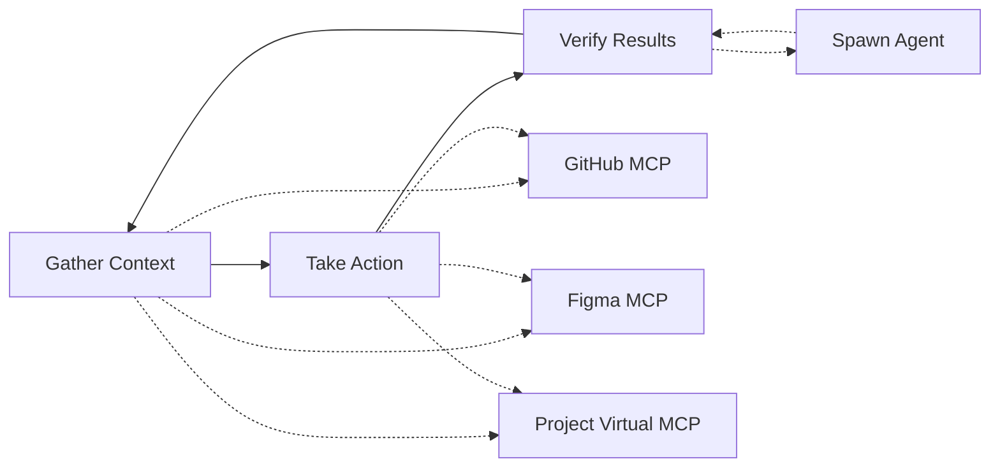

import Callout from "../../../../components/ui/Callout.astro";

<Callout type="info">
  This page documents the **planned architecture** for decopilot. The implementation is in development.
</Callout>

## What is Decopilot?

**Decopilot** is an agentic AI assistant that operates through the Model Context Protocol within decocms. Unlike traditional AI coding assistants that work with local filesystems, decopilot orchestrates distributed MCP servers over HTTP (or stdio when running locally) to deliver state-of-the-art agentic workflows.

Decopilot brings the proven agentic loop pattern—**gather context → take action → verify results**—to MCP orchestration. It coordinates work across multiple MCP servers, dynamically adapting based on scope, and delegating to specialized agents when needed. This distributed MCP architecture makes decopilot fundamentally different from filesystem-based assistants: it's an MCP orchestration layer, not a development tool.

Decopilot uses **virtual MCPs** to make creating and modifying MCPs as easy and liquid as creating files on a filesystem—but with the added benefit of being distributable across the web. While decopilot invokes tools from external MCP servers (GitHub, Figma, Slack), it operates on virtual MCPs to dynamically reshape the environment as it works. Projects, agents, and organization scopes are all virtual MCPs, providing the editable, programmable foundation that enables decopilot's agentic capabilities.

<Callout type="tip" title="New to Decopilot?">
Start with the [Quick Start](/en/mcp-mesh/decopilot/quickstart) guide to see the agentic loop in action with practical workflows.
</Callout>

## The Agentic Loop

Decopilot operates through a continuous cycle that adapts to your work:

**1. Gather Context**: Query connected MCP servers to understand current state
- Read GitHub repositories to check branch status and recent commits
- Fetch Figma designs to understand UI specifications
- Query databases or APIs to verify data state
- Load project resources (architecture docs, checklists, guidelines)

**2. Take Action**: Execute tools across distributed MCP servers
- Create branches, commit code, open pull requests via GitHub MCP
- Export assets, check design specs via Figma MCP
- Send notifications, update channels via Slack MCP
- Create inline tools in virtual MCPs for project-specific operations

**3. Verify Results**: Check outcomes and determine next steps
- Confirm actions completed successfully across all services
- Spawn specialized agents to verify code quality, security, or performance
- Update project resources with findings
- Report results and recommend follow-up actions

This loop runs continuously as you work, with decopilot adapting based on scope. The distributed nature means decopilot can orchestrate complex workflows spanning multiple services—all coordinated through the MCP protocol.



## Distributed MCP Architecture

Decopilot's core differentiator is its **distributed MCP architecture**—the ability to coordinate work across multiple MCP servers while operating on editable virtual MCPs.

**External MCP Servers (Read-Only)**: Decopilot invokes tools from external MCP servers like GitHub, Figma, Slack, and databases. These servers expose their capabilities through the MCP protocol (over HTTP or stdio). Decopilot uses these tools but cannot modify the server configurations—they're external, read-only connections.

**Virtual MCPs (Editable)**: Decopilot operates on virtual MCPs—editable MCP endpoints that can be modified dynamically. When working in a project, decopilot can add tools, create resources, update prompts, and reshape the virtual MCP configuration. This is the programmable layer that makes decopilot's dynamic behavior possible.

**Composition**: External MCP servers are composed into virtual MCPs through connections. A project's virtual MCP might include GitHub tools, Figma tools, and custom inline tools—all available through one unified MCP endpoint. Decopilot operates on this composed virtual MCP while invoking tools from the external servers.

**Protocol-Based Orchestration**: MCP coordination happens over HTTP for remote servers or stdio for local servers. Decopilot doesn't need filesystem access—it coordinates distributed MCP servers through the MCP protocol. This makes decopilot portable, scalable, and composable across your infrastructure.

This architecture enables workflows that span multiple services in a single agentic loop. Need to create a branch, export Figma assets, and notify the team? Decopilot orchestrates all three through distributed MCP calls, verifies success, and reports back—pure MCP orchestration.

## Key Capabilities

**Agentic Workflow Orchestration**: The continuous gather → act → verify loop enables decopilot to handle complex, multi-step workflows autonomously. Decopilot breaks down ambiguous requests into concrete actions, executes them across distributed services, and adapts based on results.

**Distributed Tool Coordination**: Invoke tools from multiple MCP servers in a single workflow. Decopilot seamlessly coordinates GitHub, Figma, Slack, databases, and custom tools—all through standardized MCP protocol.

**Dynamic Environment Configuration**: Operating on virtual MCPs means decopilot can reshape the environment as it works. Add tools on the fly, create resources for documentation, update prompts based on patterns—all without manual configuration.

**Scope-Sensitive Operations**: Decopilot automatically adapts based on where you are in the application. Organization scope provides org-wide capabilities. Project scope gives project-specific tools and context. Agent scope bounds operations to focused purposes.

**Agent Spawning**: Delegate to specialized agents with fresh context for parallel work. Spawn a security agent to review code while continuing with implementation. Spawn a research agent to explore architecture while keeping the main context clean.

**Context Management**: Intelligent token management through strategic agent spawning and tool filtering. Decopilot balances completeness with efficiency, ensuring relevant context without bloat.

## Scope-Based Operation

Decopilot operates in **three distinct scopes**, each corresponding to a different virtual MCP:

**Org Scope** (`/:org/settings`): Organization-wide context with shared resources, prompts, and connected MCPs. Think of this as the foundation level—comparable to `~/.claude/` in Claude Code.

**Project Scope** (`/:org/projects/:id`): Project-specific virtual MCP with project tools, resources, and connected external MCPs. Isolated work context for the project—comparable to `.claude/` in Claude Code.

**Agent Scope** (`/:org/agents/:id`): Single-purpose virtual MCP optimized for repeatable tasks. Most narrowly focused scope with bounded tool access.

The route determines the scope automatically. As you navigate the application, decopilot seamlessly adapts to the new context, adjusting available tools, resources, and capabilities accordingly.

For detailed information on how scopes work and when to use each, see [Scopes](/en/mcp-mesh/decopilot/scopes).

## Quick Examples

### Multi-Server Workflow

Working in a project, you ask decopilot to prepare a feature branch:

```typescript
// Decopilot orchestrates across 3 MCP servers:

// 1. GitHub MCP - Create feature branch
CREATE_BRANCH({ name: "feature/biometric-auth", base: "main" })

// 2. Figma MCP - Export latest auth flow designs
EXPORT_ASSETS({ fileId: "auth-flows", format: "svg" })

// 3. Slack MCP - Notify team
SEND_MESSAGE({ channel: "engineering", text: "Started biometric auth feature" })

// All coordinated through decopilot's agentic loop
```

### Agent Spawning Pattern

Need security review while continuing development:

```typescript
// Main loop: Implementing feature
User: "Add biometric authentication"

Decopilot:
- Plans implementation approach
- Spawns security agent on parallel task

// Spawned agent (isolated context)
Agent: security-reviewer-001
- Scans authentication files
- Checks for common vulnerabilities
- Generates findings report
- Returns to main loop

// Main loop continues
Decopilot:
- Completes implementation
- Integrates security findings
- Updates code based on recommendations
```

The agent runs with fresh context, preventing token bloat while enabling focused security analysis in parallel.

<Callout type="note" title="For Claude Code Users">
  If you're familiar with Claude Code, here's how decopilot concepts map to what you know:

| Claude Code | Decopilot |
|-------------|-----------|
| Agentic loop (local) | Agentic loop (distributed MCP) |
| Skills | Virtual MCPs (agents) |
| `project/.claude/` | Project scope (`/:org/projects/:id`) |
| `~/.claude/` | Org scope (org routes) |
| Subagents | Agent spawning with `agent_spawn` |
| CLAUDE.md | CLAUDE.md + AGENTS.md |
| Skill references/assets | MCP resources |
| `/command` invocation | MCP commands |

**Key difference**: Decopilot brings Claude Code's agentic patterns to MCP orchestration through distributed architecture. Instead of local filesystem operations, decopilot coordinates work across multiple MCP servers—GitHub, Figma, Slack, databases, and more—all through standardized MCP protocol.
</Callout>

## Next Steps

**[Quick Start](/en/mcp-mesh/decopilot/quickstart)**: See the agentic loop in action with practical workflows. Start here for hands-on examples.

**[Scopes](/en/mcp-mesh/decopilot/scopes)**: Learn how org/project/agent scopes determine available tools and context. Essential for understanding decopilot's behavior.

**[Architecture](/en/mcp-mesh/decopilot/architecture)**: Deep-dive into decopilot's technical implementation, virtual MCP constraint, and distributed coordination.

**[Tools](/en/mcp-mesh/decopilot/tools)**: Explore the comprehensive toolset for MCP management and tool discovery patterns.

**[Virtual MCPs](/en/mcp-mesh/virtual-mcps)**: Understand why virtual MCPs enable dynamic configuration and how they differ from external MCP servers.

---

Decopilot represents a new approach to MCP orchestration—**HTTP-based, MCP-first, and built on distributed architecture**. By operating through virtual MCPs and coordinating across external MCP servers, decopilot delivers the proven agentic loop pattern as an MCP orchestration layer. This is the agentic assistant that runs on decocms.
