import Callout from "../../../../components/ui/Callout.astro";

This guide shows practical decopilot workflows with the **agentic loop** in action. Each workflow demonstrates how decopilot gathers context from distributed MCP servers, takes coordinated actions, and verifies results—all while adapting based on scope.

<Callout type="info" title="Understanding Scopes">
These workflows adapt based on scope (org/project/agent). Learn more in [Scopes](/en/mcp-mesh/decopilot/scopes).
</Callout>

## Prerequisites

Before starting, you'll need:

- **Access to a deco CMS organization**: With permission to create and modify projects
- **At least one project with connected MCP servers**: GitHub is recommended for these examples
- **Basic MCP familiarity**: Understanding of tools, resources, and the MCP protocol helps but isn't required

If you haven't set up MCP servers yet, see [Connections](/en/mcp-mesh/connections).

## Workflow 1: Creating a Pull Request

This workflow shows the complete agentic loop with an external MCP server (GitHub).

### The Request

You're working in a project and ready to create a pull request for your feature:

```
User: "Create a PR for the authentication feature"
```

### Step 1: Gather Context

Decopilot begins by gathering context from the GitHub MCP:

```typescript
// Decopilot internally:
// 1. Check current branch state
const branch = await GIT_BRANCH_STATUS({ repo: "mobile-app" })
// => { name: "feature/biometric-auth", ahead: 5, behind: 0 }

// 2. Review recent commits
const commits = await GIT_LOG({ repo: "mobile-app", limit: 5 })
// => [
//   { sha: "abc123", message: "Add biometric scanner component" },
//   { sha: "def456", message: "Implement face recognition flow" },
//   ...
// ]

// 3. Check for uncommitted changes
const status = await GIT_STATUS({ repo: "mobile-app" })
// => { modified: [], staged: [], untracked: [] }
```

**Learning point**: Decopilot queries the GitHub MCP to understand the current state before taking action. This ensures the PR creation is context-aware.

### Step 2: Take Action

With context gathered, decopilot searches for and enables the appropriate tool:

```typescript
// 1. Search for GitHub tools related to PRs
const tools = await tools_search({
  search_term: "pull request github",
  scope: "project"
})
// => [
//   { name: "CREATE_PR", description: "Create a pull request on GitHub" },
//   { name: "UPDATE_PR", description: "Update existing pull request" },
//   ...
// ]

// 2. Enable the CREATE_PR tool
await tool_enable({ tool_name: "CREATE_PR" })

// 3. Create PR with context-aware description
await CREATE_PR({
  repo: "mobile-app",
  title: "Add biometric authentication",
  body: `## Summary
- Implemented biometric scanner component
- Added face recognition flow
- Integrated with iOS/Android APIs

## Testing
- Tested on iPhone 14 Pro with Face ID
- Tested on Pixel 7 with fingerprint scanner`,
  base: "main",
  head: "feature/biometric-auth"
})
```

**Learning point**: The discover → enable → use pattern is fundamental to decopilot's tool workflow. Tools from external MCPs must be enabled before use.

### Step 3: Verify Results

Decopilot confirms the PR was created successfully:

```typescript
// Check PR creation result
// => {
//   success: true,
//   pr_number: 142,
//   url: "https://github.com/org/mobile-app/pull/142"
// }

// Report to user
"✓ Created PR #142: Add biometric authentication
  View: https://github.com/org/mobile-app/pull/142"
```

**Learning point**: The agentic loop doesn't stop at execution—decopilot verifies success and reports meaningful results.

### The Complete Loop

```mermaid
sequenceDiagram
    participant User
    participant Decopilot
    participant GitHub_MCP

    User->>Decopilot: "Create a PR for the auth feature"

    Note over Decopilot: GATHER CONTEXT
    Decopilot->>GitHub_MCP: GIT_BRANCH_STATUS
    GitHub_MCP-->>Decopilot: feature/biometric-auth (5 commits ahead)
    Decopilot->>GitHub_MCP: GIT_LOG
    GitHub_MCP-->>Decopilot: Recent commits
    Decopilot->>GitHub_MCP: GIT_STATUS
    GitHub_MCP-->>Decopilot: No uncommitted changes

    Note over Decopilot: TAKE ACTION
    Decopilot->>Decopilot: tools_search("pull request")
    Decopilot->>Decopilot: tool_enable("CREATE_PR")
    Decopilot->>GitHub_MCP: CREATE_PR(...)
    GitHub_MCP-->>Decopilot: PR #142 created

    Note over Decopilot: VERIFY RESULTS
    Decopilot-->>User: ✓ Created PR #142 (link)
```



## Workflow 2: Spawning a Security Review Agent

This workflow demonstrates agent spawning for parallel work with isolated context.

### The Request

You're implementing a feature and want security review to happen in parallel:

```
User: "Add biometric authentication and run security review"
```

### Main Loop: Implementation

Decopilot begins implementation in the main context:

```typescript
// Main decopilot loop
// 1. Plan implementation approach
const plan = await resource_read("project://mobile-app/architecture-decisions", {
  lineStart: 0,
  lineEnd: 0
})

// 2. Check existing auth infrastructure
const authFiles = await tools_search({
  search_term: "authentication",
  scope: "project"
})

// 3. Spawn security agent on parallel task
const agentTask = await agent_spawn({
  agent_id: "security-reviewer",
  task: "Review biometric authentication implementation for security vulnerabilities",
  context: {
    files: ["src/auth/biometric.ts", "src/auth/face-recognition.ts"],
    focus: "authentication security"
  }
})
// => { task_id: "task-abc123", status: "in_progress" }
```

**Learning point**: Agent spawning happens early in the workflow, allowing parallel execution while the main loop continues.

### Spawned Agent: Security Review

The spawned agent runs with **fresh context**, isolated from the main loop:

```typescript
// Inside security-reviewer agent (isolated context)
// Agent has bounded tool access: security scanning, CVE lookup, file reading

// 1. Gather context - read security checklist
const checklist = await resource_read("agent://security-reviewer/checklist", {
  lineStart: 0,
  lineEnd: 0
})

// 2. Take action - scan authentication files
const scanResults = await SECURITY_SCAN({
  files: ["src/auth/biometric.ts", "src/auth/face-recognition.ts"],
  rules: ["auth", "crypto", "input-validation"]
})

// 3. Check known vulnerabilities
const cveResults = await CVE_LOOKUP({
  dependencies: ["face-api.js", "biometric-sdk"]
})

// 4. Generate findings report
const findings = {
  critical: [],
  high: [
    "Biometric templates stored without encryption",
    "Face recognition threshold too permissive (0.5)"
  ],
  medium: [
    "Missing rate limiting on auth attempts"
  ],
  info: [
    "Consider implementing liveness detection"
  ]
}

// Agent completes and returns findings
return { status: "completed", findings }
```

**Learning point**: The agent operates in an isolated context with only the tools it needs. This prevents token bloat and enables focused analysis.

### Main Loop: Integration

Back in the main loop, decopilot integrates the findings:

```typescript
// Main loop continues
// 1. Complete implementation
await tool_enable({ tool_name: "CREATE_FILE" })
await CREATE_FILE({
  path: "src/auth/biometric.ts",
  content: "// Implementation..."
})

// 2. Check agent task status
const agentResult = await agent_task_status({ task_id: "task-abc123" })
// => { status: "completed", findings: { ... } }

// 3. Update implementation based on findings
await tool_enable({ tool_name: "UPDATE_FILE" })
await UPDATE_FILE({
  path: "src/auth/biometric.ts",
  changes: [
    "Encrypt biometric templates with AES-256",
    "Increase face recognition threshold to 0.7",
    "Add rate limiting middleware"
  ]
})

// 4. Create resource documenting findings
await resource_create({
  uri: "project://mobile-app/security-findings-2024-02",
  name: "Security Review: Biometric Auth",
  content: JSON.stringify(agentResult.findings, null, 2)
})
```

**Learning point**: The main loop continues working while the agent runs, then integrates results when ready. This is efficient parallel execution.

### The Complete Flow


## Workflow 3: Multi-Server Orchestration

This workflow shows coordination across multiple MCP servers in a single operation.

### The Request

You need to set up a feature branch across multiple services:

```
User: "Create feature branch, export Figma assets, and notify the team"
```

### The Agentic Loop

Decopilot orchestrates across three MCP servers:

```typescript
// GATHER CONTEXT

// 1. Check GitHub repository state
const repo = await GIT_BRANCH_STATUS({ repo: "mobile-app" })
// => { name: "main", clean: true }

// 2. Check Figma for latest designs
const figmaFile = await FIGMA_GET_FILE({ file_id: "mobile-app-designs" })
// => { last_modified: "2024-02-08", version: "1.42" }

// 3. Check Slack channel for previous notifications
const history = await SLACK_GET_HISTORY({
  channel: "engineering",
  limit: 10
})
// => [...recent messages]

// TAKE ACTION

// 1. GitHub MCP - Create feature branch
await tool_enable({ tool_name: "CREATE_BRANCH" })
const branch = await CREATE_BRANCH({
  repo: "mobile-app",
  name: "feature/new-onboarding",
  base: "main"
})
// => { success: true, branch: "feature/new-onboarding" }

// 2. Figma MCP - Export design assets
await tool_enable({ tool_name: "EXPORT_ASSETS" })
const assets = await EXPORT_ASSETS({
  file_id: "mobile-app-designs",
  node_ids: ["onboarding-flow", "welcome-screen"],
  format: "svg",
  scale: 2
})
// => {
//   success: true,
//   files: [
//     { name: "onboarding-flow.svg", url: "..." },
//     { name: "welcome-screen.svg", url: "..." }
//   ]
// }

// 3. Slack MCP - Notify team
await tool_enable({ tool_name: "SEND_MESSAGE" })
const notification = await SEND_MESSAGE({
  channel: "engineering",
  text: `🚀 Started new onboarding feature
Branch: feature/new-onboarding
Figma assets: ${assets.files.length} files exported
Design version: 1.42`
})
// => { success: true, timestamp: "1707398400" }

// VERIFY RESULTS

// Confirm all operations succeeded
const results = {
  github: branch.success,      // ✓
  figma: assets.success,        // ✓
  slack: notification.success   // ✓
}

// Report to user
"✓ Feature setup complete:
  • Branch created: feature/new-onboarding
  • Exported 2 Figma assets
  • Team notified in #engineering"
```

**Learning point**: Decopilot coordinates multiple MCP servers in a single workflow. Each server is called through the MCP protocol (HTTP for remote, stdio for local), with decopilot orchestrating the sequence.

### Distributed Architecture in Action


**Learning point**: This is the distributed MCP architecture in action—web-native coordination across multiple services through standardized protocol.

## Workflow 4: Dynamic Tool Creation

This workflow demonstrates decopilot's ability to edit virtual MCPs by creating tools on the fly.

### The Request

You need a custom tool for a project-specific operation:

```
User: "We need a tool to run the mobile test suite on all platforms"
```

### The Agentic Loop

Decopilot operates on the project's virtual MCP to create an inline tool:

```typescript
// GATHER CONTEXT

// 1. Check existing test infrastructure
const testTools = await tools_search({
  search_term: "test",
  scope: "project"
})
// => [
//   { name: "RUN_TESTS", description: "Run test suite for a platform" },
//   { name: "TEST_RESULTS", description: "Get test results" }
// ]

// 2. Read project testing documentation
const testDocs = await resource_read("project://mobile-app/testing-guide", {
  lineStart: 0,
  lineEnd: 0
})

// TAKE ACTION

// 1. Create inline tool in project virtual MCP
await tool_create({
  name: "RUN_MOBILE_TESTS_ALL_PLATFORMS",
  description: "Run complete mobile test suite on iOS and Android",
  inputSchema: {
    type: "object",
    properties: {
      suite: {
        type: "string",
        enum: ["unit", "integration", "e2e", "all"],
        description: "Test suite to run"
      }
    }
  },
  implementation: {
    type: "workflow",
    steps: [
      {
        tool: "RUN_TESTS",
        input: { platform: "ios", suite: "{{input.suite}}" }
      },
      {
        tool: "RUN_TESTS",
        input: { platform: "android", suite: "{{input.suite}}" }
      }
    ]
  }
})

// 2. Enable the newly created tool
await tool_enable({ tool_name: "RUN_MOBILE_TESTS_ALL_PLATFORMS" })

// 3. Use it immediately
const results = await RUN_MOBILE_TESTS_ALL_PLATFORMS({
  suite: "integration"
})
// => {
//   ios: { passed: 142, failed: 0, skipped: 3 },
//   android: { passed: 138, failed: 2, skipped: 7 }
// }

// VERIFY RESULTS

// Check test outcomes
const summary = {
  ios: results.ios.failed === 0 ? "✓ Pass" : "✗ Fail",
  android: results.android.failed === 0 ? "✓ Pass" : "✗ Fail"
}

// Report to user
"✓ Created RUN_MOBILE_TESTS_ALL_PLATFORMS tool
  Results:
  • iOS: ✓ Pass (142/145 tests)
  • Android: ✗ Fail (138/147 tests, 2 failures)"
```

**Learning point**: Decopilot can create tools in virtual MCPs and use them immediately. This is only possible because projects are virtual MCPs—editable and configurable.

### Virtual MCP Editability


**Learning point**: The virtual MCP is the editable layer. Decopilot operates on it to add tools, resources, and configuration—something impossible with external MCP servers.

## Tips for Effective Use

### 1. Leverage Scopes Appropriately

**Org scope** for organization-wide setup:
- Connect external MCP servers (GitHub org, Slack workspace)
- Create shared resources (security policies, coding standards)
- Define org-level prompt templates

**Project scope** for feature development:
- Use project-specific tools and resources
- Create inline tools for project operations
- Coordinate work across connected MCPs

**Agent scope** for focused tasks:
- Delegate to specialized agents (security, testing, research)
- Benefit from fresh context and bounded tool access

### 2. Spawn Agents Strategically

**Good candidates for agent spawning**:
- Security reviews (parallel to implementation)
- Research tasks (exploring architecture, investigating bugs)
- Testing workflows (comprehensive test runs)
- Code quality checks (linting, formatting, documentation)

**Keep in main loop**:
- Feature implementation (needs full context)
- User interactions (requires responsiveness)
- Sequential workflows (where order matters)

### 3. Work with Virtual MCPs

**Create resources** for documentation:
```typescript
await resource_create({
  uri: "project://mobile-app/architecture-decisions",
  name: "Architecture Decisions",
  content: "# ADRs\n\n..."
})

// Read back the resource
await resource_read("project://mobile-app/architecture-decisions", {
  lineStart: 0,
  lineEnd: 0
})
```

**Create inline tools** for project operations:
```typescript
await tool_create({
  name: "DEPLOY_STAGING",
  description: "Deploy to staging environment",
  // ...
})
```

**Update prompts** based on workflow patterns:
```typescript
await prompt_update({
  name: "code-review",
  template: "Review this code for:\n- Security\n- Performance\n..."
})
```

### 4. Monitor Task Status

When spawning agents, check status:
```typescript
const status = await agent_task_status({ task_id: "task-abc123" })
// => { status: "in_progress" | "completed" | "failed" }
```

Integrate results when ready:
```typescript
if (status.status === "completed") {
  // Use agent findings
}
```

## Next Steps

**[Scopes](/en/mcp-mesh/decopilot/scopes)**: Understand how org/project/agent scopes determine behavior and tool availability. Essential for effective decopilot use.

**[Tasks](/en/mcp-mesh/decopilot/tasks-and-spawning)**: Learn advanced patterns for agent spawning, including fan-out/fan-in, conditional spawning, and agent selection.

**[Tools](/en/mcp-mesh/decopilot/tools)**: Explore the comprehensive toolset, discover patterns, and troubleshoot common issues.

**[Context](/en/mcp-mesh/decopilot/context)**: Optimize token usage through strategic agent spawning and context filtering.

**[Architecture](/en/mcp-mesh/decopilot/architecture)**: Deep-dive into decopilot's technical implementation and distributed MCP coordination.

---

You've seen the agentic loop in action across four practical workflows. Decopilot brings proven agentic patterns to web-based development through distributed MCP architecture—gather context, take coordinated actions, and verify results, all while adapting to scope. This is the foundation for state-of-the-art agentic workflows in deco CMS.
