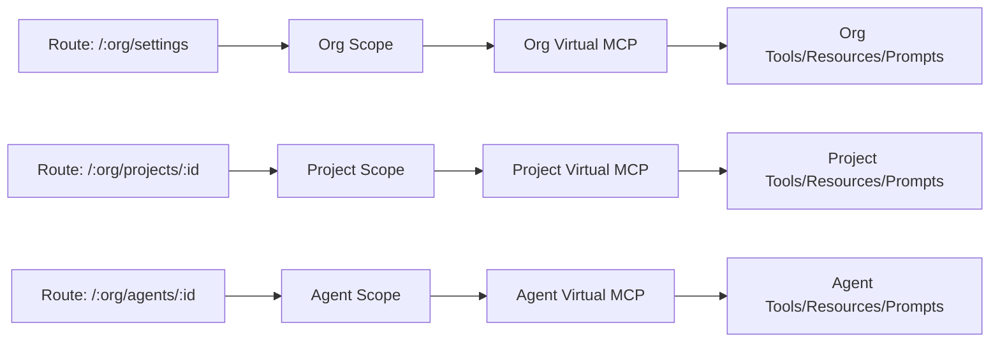

import Callout from "../../../../components/ui/Callout.astro";

<Callout type="info">
  This page documents the **planned architecture** for decopilot scopes. The implementation is in development.
</Callout>

## What is Scope?

**Scope** is the current virtual MCP context in which decopilot operates. It determines what tools, resources, and prompts are available, and how decopilot behaves when you interact with it.

Unlike traditional tools that operate in a single global context, decopilot is **scope-sensitive**—it automatically adapts based on where you are in the application. Think of scope as your current working environment that changes as you navigate routes in decocms.

Scope affects every operation: tool availability, resource reading, prompt loading, and tool execution. This architecture ensures isolation (projects cannot access each other's tools), security (access control at the scope level), and clarity (you always know what capabilities are available).

## Three Scope Types

Decopilot operates in three distinct scopes, each a **virtual MCP** with its own capabilities.

### Org Scope

**Route**: `/:org/settings`, `/:org/connections`

**Behavior**: Operates like an org-admin, similar to `~/.claude` in Claude Code. Provides org-wide resources, prompts, and tools accessible across all projects and agents. This is the foundation level where shared context is defined.

### Project Scope

**Route**: `/:org/projects/:project_id`

**Behavior**: Projects **ARE virtual MCPs**, not containers. Each project is a self-contained MCP server with project-specific tools, resources, and connected MCPs (GitHub, Figma, etc.). Mirrors Claude Code's `.claude/` pattern—isolated work context.

### Agent Scope

**Route**: `/:org/agents/:agent_id`

**Behavior**: Agents **ARE virtual MCPs** optimized for single-purpose tasks. They are bounded and focused, with agent-specific capabilities and resources. Most narrowly focused scope for repeatable, well-defined tasks.

## How Scope is Determined

Scope is **automatically determined by the route** you navigate to in decocms. As you move through the application, decopilot seamlessly adapts to the new context.



### Route-to-Scope Mapping

| Route Pattern | Scope Type | Virtual MCP |
|---|---|---|
| `/:org/settings` | Org | Organization virtual MCP |
| `/:org/connections` | Org | Organization virtual MCP |
| `/:org/projects/:project_id` | Project | Project-specific virtual MCP |
| `/:org/projects/:project_id/settings` | Project | Project-specific virtual MCP |
| `/:org/agents/:agent_id` | Agent | Agent-specific virtual MCP |
| `/:org/agents/:agent_id/config` | Agent | Agent-specific virtual MCP |

## Scope-Sensitive Operations

All decopilot operations are **scope-aware**. The current scope determines what happens when you execute commands, read resources, or invoke tools.

<Callout type="info">
  The examples below use conceptual API syntax to illustrate scope behavior.
</Callout>

### Reading Resources

```typescript
// Resources are read from the current scope's virtual MCP
decopilot.readResource("org://guidelines")           // Org scope
decopilot.readResource("project://mobile-app/arch")  // Project scope
decopilot.readResource("agent://reviewer/checklist") // Agent scope
```

### Tool Availability

```typescript
// Tools depend on the current scope
decopilot.listTools()
// Org: ["ORG_CONNECTION_CREATE", "ORG_RESOURCE_CREATE", ...]
// Project: ["CREATE_PR", "GET_DESIGN", "RUN_TESTS", ...]
// Agent: ["REVIEW_CODE", "ANALYZE_SECURITY", ...]
```

## Virtual MCPs at Every Level

**Everything in decocms is a virtual MCP**. Orgs, projects, and agents are all virtual MCPs with tools, resources, prompts, and configuration. The scope hierarchy creates an inheritance model where projects and agents access org-level capabilities while maintaining their own scope-specific additions.

## Practical Examples

### Project Scope Example

Working on a mobile app project (`/:org/projects/mobile-app`):

```typescript
// Tools include GitHub, Figma, project-specific capabilities
decopilot.listTools()
// Returns: CREATE_PR, GET_DESIGN, RUN_MOBILE_TESTS

// Read project context
decopilot.readResource("project://mobile-app/guidelines")

// Create PR using project's GitHub connection
decopilot.invokeTool("CREATE_PR", {
  title: "Add login screen"
})
```

### Agent Scope Example

Using a code review agent (`/:org/agents/code-reviewer`):

```typescript
// Bounded tools for specific task
decopilot.listTools()
// Returns: SECURITY_REVIEW, PERFORMANCE_REVIEW, CODE_ANALYSIS

// Execute security analysis
decopilot.invokeTool("SECURITY_REVIEW", {
  code: "const query = `SELECT * FROM users WHERE id = ${userId}`"
})
```

## Key Takeaways

- **Scope is fundamental**: Every operation happens within a scope
- **Routes determine scope**: Navigation automatically changes context
- **Three scope types**: Org, Project, Agent
- **Everything is a virtual MCP**: Each level has tools, resources, and prompts
- **Automatic adaptation**: Decopilot adjusts behavior as you navigate

Understanding scope is essential to using decopilot effectively—it ensures clarity, security, and organization.

---

**Ready to dive deeper?** Learn about [Virtual MCPs](/en/mcp-mesh/virtual-mcps) or explore [Projects](/en/mcp-mesh/projects).
