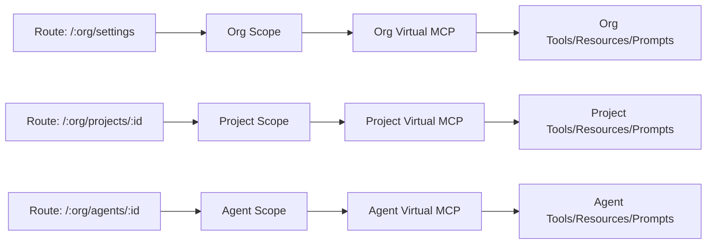

import Callout from "../../../../components/ui/Callout.astro";

<Callout type="info">
  This page documents the **planned architecture** for decopilot scopes. The implementation is in development.
</Callout>

## What is Scope?

**Scope** is the current virtual MCP context in which decopilot operates. It determines what tools, resources, and prompts are available, and how decopilot behaves when you interact with it.

Unlike traditional tools that operate in a single global context, decopilot is **scope-sensitive**—it automatically adapts based on where you are in the application. Think of scope as your current working environment that changes as you navigate routes in decocms.

Scope affects every operation: tool availability, resource reading, prompt loading, and tool execution. This architecture ensures isolation (projects cannot access each other's tools), security (access control at the scope level), and clarity (you always know what capabilities are available).

## Three Scope Types

Decopilot operates in three distinct scopes, each a **virtual MCP** with its own capabilities.

### Org Scope

**Route**: `/:org/settings`, `/:org/connections`

**Behavior**: Operates like an org-admin, similar to `~/.claude` in Claude Code. Provides org-wide resources, prompts, and tools accessible across all projects and agents. This is the foundation level where shared context is defined.

### Project Scope

**Route**: `/:org/projects/:project_id`

**Behavior**: Projects **ARE virtual MCPs**, not containers. Each project is a self-contained MCP server with project-specific tools, resources, and connected MCPs (GitHub, Figma, etc.). Mirrors Claude Code's `.claude/` pattern—isolated work context.

### Agent Scope

**Route**: `/:org/agents/:agent_id`

**Behavior**: Agents **ARE virtual MCPs** optimized for single-purpose tasks. They are bounded and focused, with agent-specific capabilities and resources. Most narrowly focused scope for repeatable, well-defined tasks.

## How Scope is Determined

Scope is **automatically determined by the route** you navigate to in decocms. As you move through the application, decopilot seamlessly adapts to the new context.



### Route-to-Scope Mapping

| Route Pattern | Scope Type | Virtual MCP |
|---|---|---|
| `/:org/settings` | Org | Organization virtual MCP |
| `/:org/connections` | Org | Organization virtual MCP |
| `/:org/projects/:project_id` | Project | Project-specific virtual MCP |
| `/:org/projects/:project_id/settings` | Project | Project-specific virtual MCP |
| `/:org/agents/:agent_id` | Agent | Agent-specific virtual MCP |
| `/:org/agents/:agent_id/config` | Agent | Agent-specific virtual MCP |

## Scope-Sensitive Operations

All decopilot operations are **scope-aware**. The current scope determines what happens when you execute commands, read resources, or invoke tools.

<Callout type="info">
  The examples below use conceptual API syntax to illustrate scope behavior.
</Callout>

### Reading Resources

```typescript
// Resources are read from the current scope's virtual MCP
decopilot.readResource("org://guidelines")           // Org scope
decopilot.readResource("project://mobile-app/arch")  // Project scope
decopilot.readResource("agent://reviewer/checklist") // Agent scope
```

### Tool Availability

```typescript
// Tools depend on the current scope
decopilot.listTools()
// Org: ["ORG_CONNECTION_CREATE", "ORG_RESOURCE_CREATE", ...]
// Project: ["CREATE_PR", "GET_DESIGN", "RUN_TESTS", ...]
// Agent: ["REVIEW_CODE", "ANALYZE_SECURITY", ...]
```

## Practical Scope Workflows

Understanding scope concepts is essential, but seeing them in action clarifies how they enable real work. Here are practical workflows demonstrating each scope type.

### Workflow 1: Org-Level Setup

**Context**: You're setting up organization-wide resources and connections.

**Route**: `/:org/settings`

**Operations**:

```typescript
// 1. Create org-level CLAUDE.md with coding standards
await resource_create({
  uri: "org://coding-standards",
  name: "CLAUDE.md",
  content: `# Coding Standards

## Style
- Use TypeScript strict mode
- Prefer functional patterns
- Document public APIs

## Security
- Never commit credentials
- Validate all user input
- Use parameterized queries`
})

// 2. Connect external MCP servers at org level
await connection_create({
  name: "GitHub Organization",
  type: "github",
  scope: "org",
  config: {
    org: "my-company",
    auth: "oauth"
  }
})

await connection_create({
  name: "Slack Workspace",
  type: "slack",
  scope: "org",
  config: {
    workspace: "my-company",
    channel_defaults: ["#engineering", "#deploys"]
  }
})

// 3. Create shared security policy resource
await resource_create({
  uri: "org://security-policy",
  name: "Security Policy",
  content: `# Security Policy

## Authentication
- Use OAuth 2.1 with PKCE
- Require MFA for production access

## Data Handling
- Encrypt PII at rest and in transit
- Implement data retention policies`
})

// 4. Define org-wide prompt templates
await prompt_create({
  name: "code-review-template",
  scope: "org",
  template: `Review this code for:
1. Security vulnerabilities
2. Performance issues
3. Code style adherence
4. Test coverage`
})
```

**Result**: Organization foundation established. All projects inherit these resources, connections, and prompts.

### Workflow 2: Project Development

**Context**: You're working on a mobile app project, coordinating across multiple services.

**Route**: `/:org/projects/mobile-app`

**Operations**:

```typescript
// 1. Read project CLAUDE.md (inherits org + project-specific)
const guidelines = await resource_read({
  uri: "project://mobile-app/guidelines"
})
// Returns: Org coding standards + project-specific patterns

// 2. Use GitHub tools to create branch (via org GitHub connection)
await tool_enable({ tool_name: "CREATE_BRANCH" })
await CREATE_BRANCH({
  repo: "mobile-app",
  name: "feature/push-notifications",
  base: "main"
})

// 3. Use Figma tools to export assets (via project Figma connection)
await tool_enable({ tool_name: "EXPORT_ASSETS" })
await EXPORT_ASSETS({
  file_id: "mobile-app-designs",
  node_ids: ["notification-icons"],
  format: "svg"
})

// 4. Create project resource for architecture decisions
await resource_create({
  uri: "project://mobile-app/architecture-decisions",
  name: "Architecture Decision: Push Notifications",
  content: `# ADR: Push Notifications

## Decision
Use Firebase Cloud Messaging (FCM) for cross-platform push.

## Rationale
- Native iOS/Android support
- Reliable delivery
- Cost effective at scale

## Alternatives Considered
- OneSignal (3rd party dependency)
- Native APNS/GCM (platform-specific complexity)`
})

// 5. Spawn security agent for review
await agent_spawn({
  agent_id: "security-reviewer",
  task: "Review push notification implementation for security",
  context: {
    files: ["src/notifications/push.ts"],
    focus: "credential storage, message encryption"
  }
})
```

**Result**: Feature developed with project-specific context, coordinating GitHub, Figma, and security review—all scoped to the project.

### Workflow 3: Agent Execution

**Context**: A spawned security agent is reviewing code with bounded capabilities.

**Route**: `/:org/agents/security-reviewer`

**Operations**:

```typescript
// 1. Read agent-specific checklist resource
const checklist = await resource_read({
  uri: "agent://security-reviewer/checklist"
})
// Returns: Security-specific checklist, not full project context

// 2. Use bounded tools for security scanning
await tool_enable({ tool_name: "SECURITY_SCAN" })
const scanResults = await SECURITY_SCAN({
  files: ["src/notifications/push.ts"],
  rules: ["credential-exposure", "insecure-storage", "xss"]
})
// => {
//   findings: [
//     {
//       severity: "high",
//       rule: "credential-exposure",
//       message: "FCM server key hardcoded on line 42"
//     }
//   ]
// }

// 3. Check known vulnerabilities
await tool_enable({ tool_name: "CVE_LOOKUP" })
const cveResults = await CVE_LOOKUP({
  dependencies: ["firebase-admin", "node-notifier"]
})

// 4. Generate findings report (can't modify project resources)
return {
  status: "completed",
  findings: {
    critical: ["FCM server key hardcoded"],
    high: [],
    medium: ["Consider rate limiting push notifications"],
    info: ["Update firebase-admin to latest version"]
  }
}
```

**Result**: Security analysis completed with fresh context and bounded tools. Agent cannot modify project resources—only reads and returns findings.

## Scope Transitions

When you navigate between routes, decopilot automatically transitions between scopes. Understanding these transitions helps you predict behavior.

### Org → Project Transition

```typescript
// Before: /:org/settings (Org scope)
await tools_list()
// => ["ORG_CONNECTION_CREATE", "ORG_RESOURCE_CREATE", ...]

// Navigate to: /:org/projects/mobile-app

// After: /:org/projects/mobile-app (Project scope)
await tools_list()
// => [
//   // Inherited org tools
//   "ORG_CONNECTION_CREATE",
//   // Project-specific tools
//   "CREATE_PR", "EXPORT_ASSETS", "RUN_TESTS",
//   // Inline project tools
//   "RUN_MOBILE_TESTS_ALL_PLATFORMS"
// ]
```

**What changes**:
- Context switches from org to project virtual MCP
- Tool availability updates (adds project + external MCP tools)
- Resource inheritance recalculates (org resources + project resources)
- Connected MCPs refresh (org connections + project connections)

### Project → Agent Transition

```typescript
// Before: /:org/projects/mobile-app (Project scope)
await tools_list()
// => ["CREATE_PR", "EXPORT_ASSETS", "RUN_TESTS", ...]

// Spawn agent: agent_spawn({ agent_id: "security-reviewer", ... })

// Inside agent: /:org/agents/security-reviewer (Agent scope)
await tools_list()
// => [
//   // Only bounded agent tools
//   "SECURITY_SCAN", "CVE_LOOKUP", "CODE_ANALYSIS"
// ]
```

**What changes**:
- Context switches to isolated agent virtual MCP
- Tool availability dramatically narrows (bounded to agent purpose)
- Resources limited to agent-specific only (no automatic project inheritance)
- Fresh token context (no pollution from parent scope)

**Key insight**: Agent scope is intentionally restricted. This prevents agents from accidentally modifying project state and keeps their context focused.

## When to Use Each Scope

Knowing which scope to operate in for different tasks improves efficiency and organization.

### Use Org Scope When:

**Setting up infrastructure**:
- Connecting external MCP servers (GitHub org, Slack workspace, Figma teams)
- Creating organization-wide resources (coding standards, security policies)
- Defining shared prompt templates
- Managing organization members and permissions

**Example tasks**:
- "Connect our GitHub organization"
- "Create org-wide coding standards"
- "Set up Slack integration for all projects"

### Use Project Scope When:

**Developing features**:
- Creating branches, pull requests, commits
- Coordinating work across multiple services (GitHub + Figma + Slack)
- Creating project-specific resources (architecture decisions, test plans)
- Using connected MCP tools for project work

**Example tasks**:
- "Create a PR for the authentication feature"
- "Export Figma assets for the onboarding flow"
- "Run the mobile test suite on all platforms"
- "Document the architecture decision for push notifications"

### Use Agent Scope When:

**Running focused, repeatable tasks**:
- Security reviews with specialized scanning
- Code quality analysis with bounded tools
- Research tasks exploring specific architecture
- Testing workflows with dedicated test runners

**Example tasks**:
- "Review this authentication code for security vulnerabilities"
- "Analyze performance of the notification service"
- "Research state management patterns in the codebase"
- "Run comprehensive integration tests"

**Decision rule**: If the task needs full project context and multiple services, use project scope. If the task is focused, repeatable, and benefits from isolation, spawn an agent.

<Callout type="tip" title="Scope Strategy">
Start in project scope for most work. Spawn agents when you need:
- **Parallel execution** (security review while implementing)
- **Fresh context** (researching architecture without bloat)
- **Bounded capabilities** (testing, analysis, review tasks)
</Callout>

## Virtual MCPs at Every Level

**Everything in decocms is a virtual MCP**. Orgs, projects, and agents are all virtual MCPs with tools, resources, prompts, and configuration. The scope hierarchy creates an inheritance model where projects and agents access org-level capabilities while maintaining their own scope-specific additions.

## Practical Examples

### Project Scope Example

Working on a mobile app project (`/:org/projects/mobile-app`):

```typescript
// Tools include GitHub, Figma, project-specific capabilities
decopilot.listTools()
// Returns: CREATE_PR, GET_DESIGN, RUN_MOBILE_TESTS

// Read project context
decopilot.readResource("project://mobile-app/guidelines")

// Create PR using project's GitHub connection
decopilot.invokeTool("CREATE_PR", {
  title: "Add login screen"
})
```

### Agent Scope Example

Using a code review agent (`/:org/agents/code-reviewer`):

```typescript
// Bounded tools for specific task
decopilot.listTools()
// Returns: SECURITY_REVIEW, PERFORMANCE_REVIEW, CODE_ANALYSIS

// Execute security analysis
decopilot.invokeTool("SECURITY_REVIEW", {
  code: "const query = `SELECT * FROM users WHERE id = ${userId}`"
})
```

## Key Takeaways

- **Scope is fundamental**: Every operation happens within a scope
- **Routes determine scope**: Navigation automatically changes context
- **Three scope types**: Org, Project, Agent
- **Everything is a virtual MCP**: Each level has tools, resources, and prompts
- **Automatic adaptation**: Decopilot adjusts behavior as you navigate

Understanding scope is essential to using decopilot effectively—it ensures clarity, security, and organization.

---

**Ready to dive deeper?** Learn about [Virtual MCPs](/en/mcp-mesh/virtual-mcps) or explore [Projects](/en/mcp-mesh/projects).
