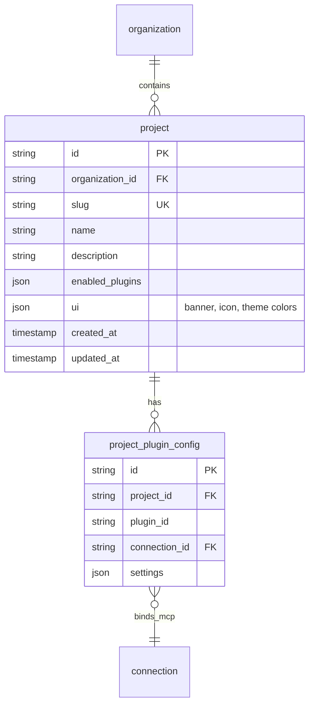

# Task 001: Database Schema and Storage Layer

## Overview

Create the database tables and storage layer for the Projects feature. This is a foundational task with no dependencies that other tasks will build upon.

## Prerequisites

- None (this task can be executed first)

## Context

Projects become the primary workspace within organizations. Every user interaction happens within a project context. The `org-admin` project is a special well-known project auto-created for each organization.

### Key Decisions

- **Unique constraint:** `(organizationId, slug)` - same slug can exist in different orgs
- **org-admin project:** Auto-created for every organization via migration
- **enabled_plugins migration:** Copy from `organization_settings.enabled_plugins` to `projects.enabled_plugins`

### Architecture



## Implementation Steps

### Step 1: Create Migration File

Create `apps/mesh/migrations/0XX-projects.ts` (find the next migration number by looking at existing migrations in `apps/mesh/migrations/`).

**projects table schema:**

```typescript
import type { Kysely } from "kysely";

export async function up(db: Kysely<unknown>): Promise<void> {
  // Create projects table
  await db.schema
    .createTable("projects")
    .addColumn("id", "text", (col) => col.primaryKey())
    .addColumn("organization_id", "text", (col) => col.notNull().references("organization.id").onDelete("cascade"))
    .addColumn("slug", "text", (col) => col.notNull())
    .addColumn("name", "text", (col) => col.notNull())
    .addColumn("description", "text")
    .addColumn("enabled_plugins", "text") // JSON array stored as text
    .addColumn("ui", "text") // JSON object stored as text
    .addColumn("created_at", "text", (col) => col.notNull())
    .addColumn("updated_at", "text", (col) => col.notNull())
    .execute();

  // Create unique index on (organization_id, slug)
  await db.schema
    .createIndex("projects_org_slug_unique")
    .on("projects")
    .columns(["organization_id", "slug"])
    .unique()
    .execute();

  // Create index for listing projects by org
  await db.schema
    .createIndex("projects_organization_id_idx")
    .on("projects")
    .column("organization_id")
    .execute();

  // Create project_plugin_configs table
  await db.schema
    .createTable("project_plugin_configs")
    .addColumn("id", "text", (col) => col.primaryKey())
    .addColumn("project_id", "text", (col) => col.notNull().references("projects.id").onDelete("cascade"))
    .addColumn("plugin_id", "text", (col) => col.notNull())
    .addColumn("connection_id", "text", (col) => col.references("connections.id").onDelete("set null"))
    .addColumn("settings", "text") // JSON object stored as text
    .addColumn("created_at", "text", (col) => col.notNull())
    .addColumn("updated_at", "text", (col) => col.notNull())
    .execute();

  // Create unique index on (project_id, plugin_id)
  await db.schema
    .createIndex("project_plugin_configs_project_plugin_unique")
    .on("project_plugin_configs")
    .columns(["project_id", "plugin_id"])
    .unique()
    .execute();

  // Seed org-admin project for all existing organizations
  // This migrates enabled_plugins from organization_settings to the org-admin project
  const orgs = await db.selectFrom("organization").select(["id"]).execute();
  
  for (const org of orgs) {
    const now = new Date().toISOString();
    const projectId = generateUlid(); // Use the project's ULID generator
    
    // Get enabled_plugins from organization_settings if it exists
    const orgSettings = await db
      .selectFrom("organization_settings")
      .select(["enabled_plugins"])
      .where("organization_id", "=", org.id)
      .executeTakeFirst();
    
    await db
      .insertInto("projects")
      .values({
        id: projectId,
        organization_id: org.id,
        slug: "org-admin",
        name: "Organization Admin",
        description: null,
        enabled_plugins: orgSettings?.enabled_plugins ?? null,
        ui: null,
        created_at: now,
        updated_at: now,
      })
      .execute();
  }
}

export async function down(db: Kysely<unknown>): Promise<void> {
  await db.schema.dropTable("project_plugin_configs").execute();
  await db.schema.dropTable("projects").execute();
}
```

**Important:** Import the ULID generator that's used elsewhere in the codebase. Check `apps/mesh/src/storage/` for how other tables generate IDs.

### Step 2: Register Migration

Update `apps/mesh/migrations/index.ts` to include the new migration:

```typescript
// Add import at the top
import * as m0XXProjects from "./0XX-projects";

// Add to migrations array
export const migrations: Record<string, Migration> = {
  // ... existing migrations
  "0XX-projects": m0XXProjects,
};
```

### Step 3: Add Storage Types

Add to `apps/mesh/src/storage/types.ts`:

```typescript
export interface ProjectUI {
  banner: string | null;
  bannerColor: string | null;
  icon: string | null;
  themeColor: string | null;
}

export interface Project {
  id: string;
  organizationId: string;
  slug: string;
  name: string;
  description: string | null;
  enabledPlugins: string[] | null;
  ui: ProjectUI | null;
  createdAt: Date;
  updatedAt: Date;
}

export interface ProjectPluginConfig {
  id: string;
  projectId: string;
  pluginId: string;
  connectionId: string | null;
  settings: Record<string, unknown> | null;
  createdAt: Date;
  updatedAt: Date;
}
```

### Step 4: Create Storage Layer

Create `apps/mesh/src/storage/projects.ts`:

```typescript
import type { Kysely } from "kysely";
import type { DB } from "../database/types";
import type { Project, ProjectUI } from "./types";
import { ulid } from "ulid";

export interface ProjectsStorage {
  list(organizationId: string): Promise<Project[]>;
  get(projectId: string): Promise<Project | null>;
  getBySlug(organizationId: string, slug: string): Promise<Project | null>;
  create(data: {
    organizationId: string;
    slug: string;
    name: string;
    description?: string | null;
    enabledPlugins?: string[] | null;
    ui?: ProjectUI | null;
  }): Promise<Project>;
  update(
    projectId: string,
    data: Partial<{
      name: string;
      description: string | null;
      enabledPlugins: string[] | null;
      ui: ProjectUI | null;
    }>
  ): Promise<Project | null>;
  delete(projectId: string): Promise<boolean>;
}

export function createProjectsStorage(db: Kysely<DB>): ProjectsStorage {
  const parseRow = (row: any): Project => ({
    id: row.id,
    organizationId: row.organization_id,
    slug: row.slug,
    name: row.name,
    description: row.description,
    enabledPlugins: row.enabled_plugins ? JSON.parse(row.enabled_plugins) : null,
    ui: row.ui ? JSON.parse(row.ui) : null,
    createdAt: new Date(row.created_at),
    updatedAt: new Date(row.updated_at),
  });

  return {
    async list(organizationId: string): Promise<Project[]> {
      const rows = await db
        .selectFrom("projects")
        .selectAll()
        .where("organization_id", "=", organizationId)
        .orderBy("created_at", "asc")
        .execute();
      return rows.map(parseRow);
    },

    async get(projectId: string): Promise<Project | null> {
      const row = await db
        .selectFrom("projects")
        .selectAll()
        .where("id", "=", projectId)
        .executeTakeFirst();
      return row ? parseRow(row) : null;
    },

    async getBySlug(organizationId: string, slug: string): Promise<Project | null> {
      const row = await db
        .selectFrom("projects")
        .selectAll()
        .where("organization_id", "=", organizationId)
        .where("slug", "=", slug)
        .executeTakeFirst();
      return row ? parseRow(row) : null;
    },

    async create(data): Promise<Project> {
      const now = new Date().toISOString();
      const id = ulid();

      await db
        .insertInto("projects")
        .values({
          id,
          organization_id: data.organizationId,
          slug: data.slug,
          name: data.name,
          description: data.description ?? null,
          enabled_plugins: data.enabledPlugins ? JSON.stringify(data.enabledPlugins) : null,
          ui: data.ui ? JSON.stringify(data.ui) : null,
          created_at: now,
          updated_at: now,
        })
        .execute();

      return this.get(id) as Promise<Project>;
    },

    async update(projectId, data): Promise<Project | null> {
      const updateData: Record<string, unknown> = {
        updated_at: new Date().toISOString(),
      };

      if (data.name !== undefined) updateData.name = data.name;
      if (data.description !== undefined) updateData.description = data.description;
      if (data.enabledPlugins !== undefined) {
        updateData.enabled_plugins = data.enabledPlugins ? JSON.stringify(data.enabledPlugins) : null;
      }
      if (data.ui !== undefined) {
        updateData.ui = data.ui ? JSON.stringify(data.ui) : null;
      }

      await db
        .updateTable("projects")
        .set(updateData)
        .where("id", "=", projectId)
        .execute();

      return this.get(projectId);
    },

    async delete(projectId: string): Promise<boolean> {
      const result = await db
        .deleteFrom("projects")
        .where("id", "=", projectId)
        .executeTakeFirst();
      return (result.numDeletedRows ?? 0) > 0;
    },
  };
}
```

Create `apps/mesh/src/storage/project-plugin-configs.ts`:

```typescript
import type { Kysely } from "kysely";
import type { DB } from "../database/types";
import type { ProjectPluginConfig } from "./types";
import { ulid } from "ulid";

export interface ProjectPluginConfigsStorage {
  list(projectId: string): Promise<ProjectPluginConfig[]>;
  get(projectId: string, pluginId: string): Promise<ProjectPluginConfig | null>;
  upsert(
    projectId: string,
    pluginId: string,
    data: {
      connectionId?: string | null;
      settings?: Record<string, unknown> | null;
    }
  ): Promise<ProjectPluginConfig>;
  delete(projectId: string, pluginId: string): Promise<boolean>;
}

export function createProjectPluginConfigsStorage(db: Kysely<DB>): ProjectPluginConfigsStorage {
  const parseRow = (row: any): ProjectPluginConfig => ({
    id: row.id,
    projectId: row.project_id,
    pluginId: row.plugin_id,
    connectionId: row.connection_id,
    settings: row.settings ? JSON.parse(row.settings) : null,
    createdAt: new Date(row.created_at),
    updatedAt: new Date(row.updated_at),
  });

  return {
    async list(projectId: string): Promise<ProjectPluginConfig[]> {
      const rows = await db
        .selectFrom("project_plugin_configs")
        .selectAll()
        .where("project_id", "=", projectId)
        .execute();
      return rows.map(parseRow);
    },

    async get(projectId: string, pluginId: string): Promise<ProjectPluginConfig | null> {
      const row = await db
        .selectFrom("project_plugin_configs")
        .selectAll()
        .where("project_id", "=", projectId)
        .where("plugin_id", "=", pluginId)
        .executeTakeFirst();
      return row ? parseRow(row) : null;
    },

    async upsert(projectId, pluginId, data): Promise<ProjectPluginConfig> {
      const now = new Date().toISOString();
      const existing = await this.get(projectId, pluginId);

      if (existing) {
        const updateData: Record<string, unknown> = { updated_at: now };
        if (data.connectionId !== undefined) updateData.connection_id = data.connectionId;
        if (data.settings !== undefined) {
          updateData.settings = data.settings ? JSON.stringify(data.settings) : null;
        }

        await db
          .updateTable("project_plugin_configs")
          .set(updateData)
          .where("project_id", "=", projectId)
          .where("plugin_id", "=", pluginId)
          .execute();

        return this.get(projectId, pluginId) as Promise<ProjectPluginConfig>;
      }

      const id = ulid();
      await db
        .insertInto("project_plugin_configs")
        .values({
          id,
          project_id: projectId,
          plugin_id: pluginId,
          connection_id: data.connectionId ?? null,
          settings: data.settings ? JSON.stringify(data.settings) : null,
          created_at: now,
          updated_at: now,
        })
        .execute();

      return this.get(projectId, pluginId) as Promise<ProjectPluginConfig>;
    },

    async delete(projectId: string, pluginId: string): Promise<boolean> {
      const result = await db
        .deleteFrom("project_plugin_configs")
        .where("project_id", "=", projectId)
        .where("plugin_id", "=", pluginId)
        .executeTakeFirst();
      return (result.numDeletedRows ?? 0) > 0;
    },
  };
}
```

### Step 5: Update Database Types

Update `apps/mesh/src/database/types.ts` (or wherever DB types are defined) to include the new tables. Look at how other tables are typed and follow the same pattern.

### Step 6: Export Storage Functions

Update `apps/mesh/src/storage/index.ts` (or the main storage export file) to export the new storage modules.

### Step 7: Add Well-Known Constants

Find where `ORG_ADMIN_PROJECT_SLUG` is defined (likely in `packages/mesh-sdk/src/constants.ts` or similar) and add:

```typescript
export const ORG_ADMIN_PROJECT_SLUG = "org-admin"; // May already exist
export const ORG_ADMIN_PROJECT_NAME = "Organization Admin";
```

## Files to Create/Modify

| File | Action |
|------|--------|
| `apps/mesh/migrations/0XX-projects.ts` | Create |
| `apps/mesh/migrations/index.ts` | Modify (register migration) |
| `apps/mesh/src/storage/types.ts` | Modify (add types) |
| `apps/mesh/src/storage/projects.ts` | Create |
| `apps/mesh/src/storage/project-plugin-configs.ts` | Create |
| `apps/mesh/src/database/types.ts` | Modify (add DB types) |
| `apps/mesh/src/storage/index.ts` | Modify (export new modules) |
| `packages/mesh-sdk/src/constants.ts` | Modify (add constant) |

## Verification

### 1. Run TypeScript Check

```bash
bun run check
```

All type errors should be resolved.

### 2. Run Migration

```bash
cd apps/mesh && bun run migrate
```

Migration should complete successfully.

### 3. Verify Database Schema

Connect to the database and verify:
- `projects` table exists with correct columns
- `project_plugin_configs` table exists with correct columns
- Unique index on `(organization_id, slug)` exists
- For each existing organization, an `org-admin` project was created

### 4. Run Lint and Format

```bash
bun run fmt
bun run lint
```

No errors should be present.

### 5. Run Tests

```bash
bun test
```

All existing tests should still pass.

## Success Criteria

- [ ] Migration file created and registered
- [ ] Migration runs successfully
- [ ] `projects` table created with correct schema
- [ ] `project_plugin_configs` table created with correct schema
- [ ] org-admin project seeded for all existing organizations
- [ ] Storage layer implemented with all CRUD operations
- [ ] Types added to storage types
- [ ] `bun run check` passes
- [ ] `bun run fmt` passes  
- [ ] `bun run lint` passes
- [ ] `bun test` passes
